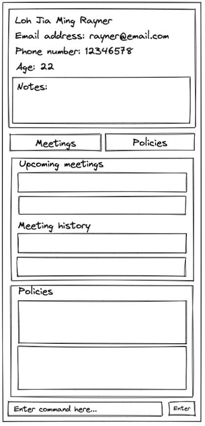

* onlyFAs is for **high achieving financial advisors** looking to maintain and develop good relationships with current and potential clients. It allows them to maintain an all-encompassing client manager app that can easily arrange for meetups with clients. Currently, target users might have to rely on apps like Google Calendar, and do not have a dedicated platform catered to helping them manage their clientele. 
  Example usages:
  * as a place to store all your client details
  * as a scheduler for your client meetings
* The project extends an ongoing software project for a desktop application (called _AddressBook_) used for managing contact details.
  * It is **written in OOP fashion**. It provides a **reasonably well-written** code base **bigger** (around 6 KLoC) than what students usually write in beginner-level SE modules, without being overwhelmingly big.
  * It comes with a **reasonable level of user and developer documentation**.
* For the detailed documentation of this project, see the **[onlyFAs Product Website](https://ay2122s2-cs2103t-w13-4.github.io/tp/)**.
* This project is based on the AddressBook-Level3 project created by the [SE-EDU initiative](https://se-education.org).
