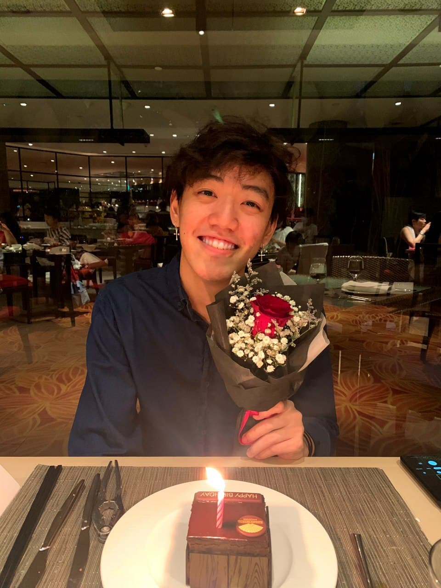
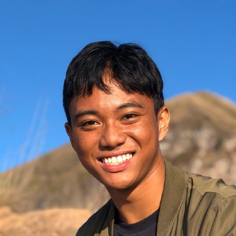

We are a team based in the [School of Computing, National University of Singapore](http://www.comp.nus.edu.sg).

You can reach us at the email `n.vijay.narayanan@u.nus.edu`

## Project team

### N Vijay Narayanan

[[github](http://github.com/myc37)]
[[portfolio](team/myc37.md)]

* Role: Team Lead
* Responsibilities: Policy features

### Loh Jia Ming, Rayner

[[github](http://github.com/raynerljm)] [[portfolio](team/raynerljm.md)]

* Role: Developer
* Responsibilities: Meeting features

### Wong Jun Yong, Joel

[[github](http://github.com/joelwongjy)]
[[portfolio](team/joelwongjy.md)]

* Role: Developer
* Responsibilities: UI

### Au Jun Wen, Zechary

[[github](http://github.com/zechajw)]
[[portfolio](team/zechajw.md)]

* Role: Developer
* Responsibilities: Data

### Maleriado Shem Limos

[[github](http://github.com/sheimoria)]
[[portfolio](team/sheimoria.md)]

* Role: Developer
* Responsibilities: CI/CD + Dev Ops
