## Table of Contents
  {:toc}

---

## **Acknowledgements**

- {list here sources of all reused/adapted ideas, code, documentation, and third-party libraries -- include links to the original source as well}

---

## **Setting up, getting started**

Refer to the guide [_Setting up and getting started_](SettingUp.md).

---

## **Design**

:bulb: **Tip:** The `.puml` files used to create diagrams in this document can be found in the [diagrams](https://github.com/se-edu/addressbook-level3/tree/master/docs/diagrams/) folder. Refer to the [_PlantUML Tutorial_ at se-edu/guides](https://se-education.org/guides/tutorials/plantUml.html) to learn how to create and edit diagrams.

### Architecture

The **_Architecture Diagram_** given above explains the high-level design of the App.

Given below is a quick overview of main components and how they interact with each other.

**Main components of the architecture**

**`Main`** has two classes called [`Main`](https://github.com/se-edu/addressbook-level3/tree/master/src/main/java/seedu/address/Main.java) and [`MainApp`](https://github.com/se-edu/addressbook-level3/tree/master/src/main/java/seedu/address/MainApp.java). It is responsible for,

- At app launch: Initializes the components in the correct sequence, and connects them up with each other.
- At shut down: Shuts down the components and invokes cleanup methods where necessary.

[**`Commons`**](#common-classes) represents a collection of classes used by multiple other components.

The rest of the App consists of four components.

- [**`UI`**](#ui-component): The UI of the App.
- [**`Logic`**](#logic-component): The command executor.
- [**`Model`**](#model-component): Holds the data of the App in memory.
- [**`Storage`**](#storage-component): Reads data from, and writes data to, the hard disk.

**How the architecture components interact with each other**

The _Sequence Diagram_ below shows how the components interact with each other for the scenario where the user issues the command `delete 1`.

Each of the four main components (also shown in the diagram above),

- defines its _API_ in an `interface` with the same name as the Component.
- implements its functionality using a concrete `{Component Name}Manager` class (which follows the corresponding API `interface` mentioned in the previous point.

For example, the `Logic` component defines its API in the `Logic.java` interface and implements its functionality using the `LogicManager.java` class which follows the `Logic` interface. Other components interact with a given component through its interface rather than the concrete class (reason: to prevent outside component's being coupled to the implementation of a component), as illustrated in the (partial) class diagram below.

The sections below give more details of each component.

### UI component

The **API** of this component is specified in [`Ui.java`](https://github.com/se-edu/addressbook-level3/tree/master/src/main/java/seedu/address/ui/Ui.java)

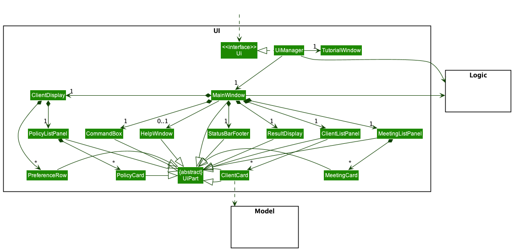

The UI consists of a `MainWindow` that is made up of parts e.g.`CommandBox`, `ResultDisplay`, `ClientListPanel`, `StatusBarFooter` etc. All these, including the `MainWindow`, inherit from the abstract `UiPart` class which captures the commonalities between classes that represent parts of the visible GUI.

The `UI` component uses the JavaFx UI framework. The layout of these UI parts are defined in matching `.fxml` files that are in the `src/main/resources/view` folder. For example, the layout of the [`MainWindow`](https://github.com/se-edu/addressbook-level3/tree/master/src/main/java/seedu/address/ui/MainWindow.java) is specified in [`MainWindow.fxml`](https://github.com/se-edu/addressbook-level3/tree/master/src/main/resources/view/MainWindow.fxml)

The `UI` component,

- executes user commands using the `Logic` component.
- listens for changes to `Model` data so that the UI can be updated with the modified data.
- keeps a reference to the `Logic` component, because the `UI` relies on the `Logic` to execute commands.
- depends on some classes in the `Model` component, as it displays `Client` object residing in the `Model`.

### Logic component

**API** : [`Logic.java`](https://github.com/se-edu/addressbook-level3/tree/master/src/main/java/seedu/address/logic/Logic.java)

Here's a (partial) class diagram of the `Logic` component:

How the `Logic` component works:

1. When `Logic` is called upon to execute a command, it uses the `AddressBookParser` class to parse the user command.
1. This results in a `Command` object (more precisely, an object of one of its subclasses e.g., `AddCommand`) which is executed by the `LogicManager`.
1. The command can communicate with the `Model` when it is executed (e.g. to add a client).
1. The result of the command execution is encapsulated as a `CommandResult` object which is returned back from `Logic`.

The Sequence Diagram below illustrates the interactions within the `Logic` component for the `execute("delete 1")` API call.

:information_source: **Note:** The lifeline for `DeleteCommandParser` should end at the destroy marker (X) but due to a limitation of PlantUML, the lifeline reaches the end of diagram.

Here are the other classes in `Logic` (omitted from the class diagram above) that are used for parsing a user command:

How the parsing works:

- When called upon to parse a user command, the `AddressBookParser` class creates an `XYZCommandParser` (`XYZ` is a placeholder for the specific command name e.g., `AddCommandParser`) which uses the other classes shown above to parse the user command and create a `XYZCommand` object (e.g., `AddCommand`) which the `AddressBookParser` returns back as a `Command` object.
- All `XYZCommandParser` classes (e.g., `AddCommandParser`, `DeleteCommandParser`, ...) inherit from the `Parser` interface so that they can be treated similarly where possible e.g, during testing.

### Model component

**API** : [`Model.java`](https://github.com/se-edu/addressbook-level3/tree/master/src/main/java/seedu/address/model/Model.java)

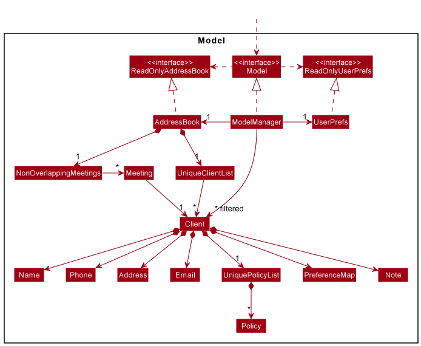

The `Model` component,

- stores the address book data i.e., all `Client` objects (which are contained in a `UniqueClientList` object).
- stores the currently 'selected' `Client` objects (e.g., results of a search query) as a separate _filtered_ list which is exposed to outsiders as an unmodifiable `ObservableList<Client>` that can be 'observed' e.g. the UI can be bound to this list so that the UI automatically updates when the data in the list change.
- stores a `UserPref` object that represents the user’s preferences. This is exposed to the outside as a `ReadOnlyUserPref` objects.
- does not depend on any of the other three components (as the `Model` represents data entities of the domain, they should make sense on their own without depending on other components)

:information_source: **Note:** An alternative (arguably, a more OOP) model is given below. It has a `Tag` list in the `AddressBook`, which `Client` references. This allows `AddressBook` to only require one `Tag` object per unique tag, instead of each `Client` needing their own `Tag` objects. 

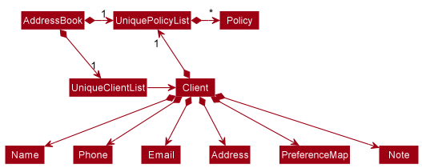

### Storage component

**API** : [`Storage.java`](https://github.com/se-edu/addressbook-level3/tree/master/src/main/java/seedu/address/storage/Storage.java)

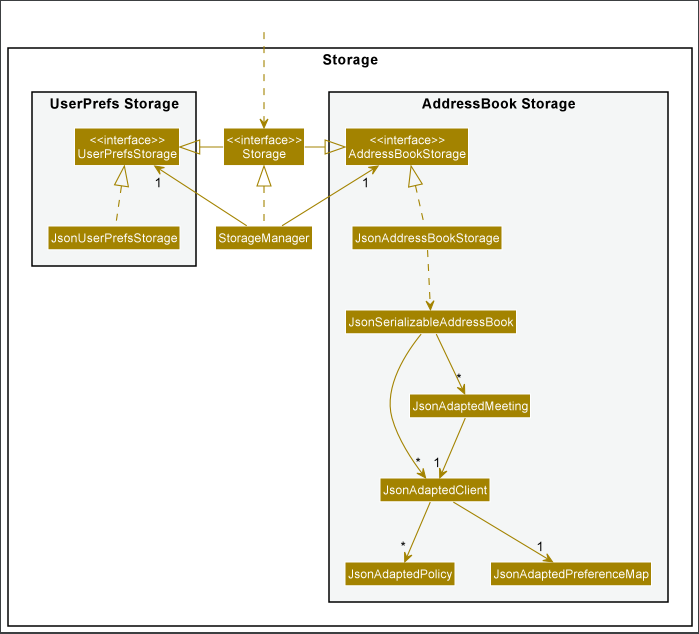

The `Storage` component,

- can save both address book data and user preference data in json format, and read them back into corresponding objects.
- inherits from both `AddressBookStorage` and `UserPrefStorage`, which means it can be treated as either one (if only the functionality of only one is needed).
- depends on some classes in the `Model` component (because the `Storage` component's job is to save/retrieve objects that belong to the `Model`)

### Common classes

Classes used by multiple components are in the `seedu.addressbook.commons` package.

---

## **Implementation**

This section describes some noteworthy details on how certain features are implemented.

<<<<<<< Updated upstream
### Client features

#### Implementation

The client feature is supported by the models `Client`, `Address`, `Date`, `DateTime`, `Email`, `Name`,
`NameContainsKeywordsPredicate`, `Note`, `Phone`, `PreferenceMap` and `UniqueClientList`.

`NameContainsKeywordsPredicate` checks whether a name contains certain keywords.

`UniqueClientList` allows for the adding, deleting and updating of clients while ensuring clients are unique.

`Preference Map` allows for the recording of client preferences in a category -> preference pair.

The `Client` model has nine attributes

1. `name`
2. `phone`
3. `email`
4. `address`
5. `birthday`
6. `lastContacted` represents the date and time the client was last contacted at
7. `policies` stores the client's policies
8. `note` records a note about the client
9. `preferences` records the client's preferences

The meeting features supports the following operations:

- Adding new client - called via the `AddCommand`
- Viewing clients in the sidebar - called via the `ViewClientCommand`
- Updating clients - called via the `EditCommand`
- Deleting clients - called via the `DeleteCommand`
- Adding note to client - called via the `AddNoteCommand`
- Adding preferences to client - called via the `AddPreferenceCommand`
- Setting client last contacted time - called via the `ContactedCommand`

### Last contacted feature

#### Implementation

This feature, which allows the user to track when they have last contacted a client, is enabled through the
`lastContacted` attribute of type `DateTime` in the `Client` class.

`DateTime` objects such as `lastContacted` only accept strings of the format `dd-MM-yy hh:mm`.

The `ContactedCommand` as well as the `EditCommand` allows for the updating of the `lastContacted` of a `Client`.

Below is an example usage scenario:

Step 1. The user launches the application. `Client`s are loaded from persistent memory with a non-null `lastContacted`
attribute. If a `Client`'s `lastContacted` has been updated previously, the datetime will show on the user interface i.e.
`Last contacted: 21-03-2022 21:03`. Otherwise, it will show `Last contacted: -`.

Step 2. The user inputs `contacted 1 dt/ 21-03-2022 21:03` to update the last contacted datetime of the first client
to `21-03-2022 21:03`. Alternatively, the user can also input `edit 1 lc/ 21-03-2022 21:03` to achieve the same result.

Note that when executing `AddCommand`, there is no need to add a parameter for `lastContacted`. This is because when a
new `Client` is created, the `lastContacted` will default to `01:01:0001 00:00`, which the user interface recognises as
a blank field i.e. `-`.

### Meetings feature

#### Implementation

The new meeting feature is supported by two new main models `Meeting` and `NonOverlappingMeetingList`. The relationship between `Meeting` to `NonOverlappingMeetingList` is similar to the relationship between `Client` and `UniqueClientList`.

The `NonOverlappingMeetingList` is stored in `AddressBook` class and ensures that no two meetings overlap.

The `Meeting` model has three attributes

1. `startDateTime` represents the starting date and time of the meeting
2. `endDateTime` represents the ending date and time of the meeting
3. `client` represents the client that is being met in this meeting

The meeting features supports the following operations:

- Adding new meetings - called via the `AddMeetingCommand`
- Viewing meetings in the sidebar - called via the `ListMeetingCommand`
- _In progress_: Updating meetings - called via the `EditMeetingCommand`
- _In progress_: Deleting meetings - called via the `DeleteMeetingCommand`

Given below is an example usage scenario and how the feature behaves:

Step 1. The user launches the application. The `NonOverlappingMeetingList` is loaded from persistent memory if it exists and be stored in the AddressBook.

Step 2. The user executes `addMeeting 1 ms/2022-01-01,11:00 me/2022-01-01,13:00` to schedule a meeting with the first client in the list on 1st January 2022 from 11:00AM to 1:00PM. The `addMeeting` command instantiates a new `Meeting` object and calls the `Model#addMeeting()` to add the object to the `NonOverlappingMeetingList`.

Step 3. The user executes `meetings` to view the meetings on the right sidebar.
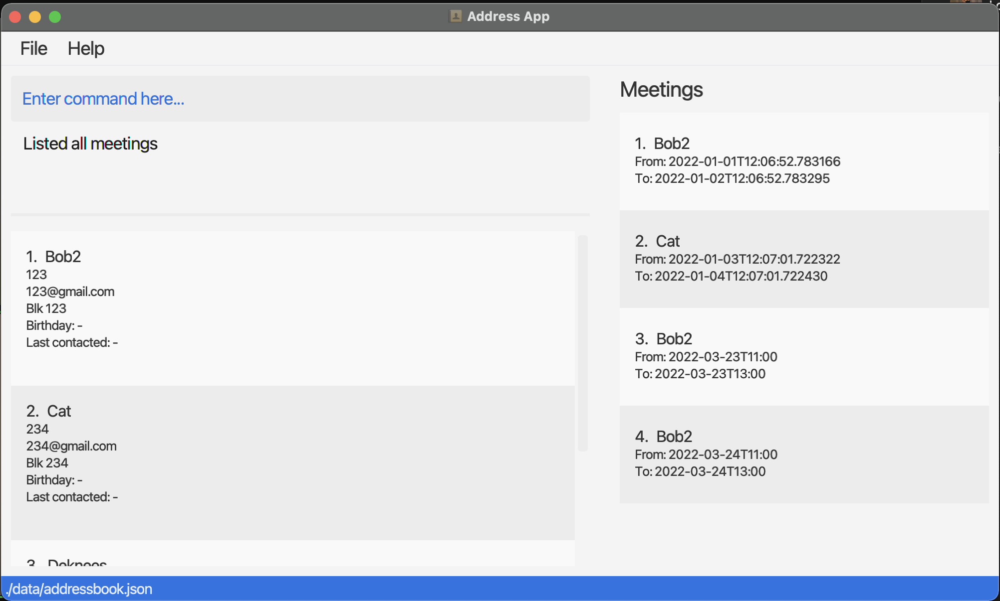

Step 4. The user executes `updateMeeting 1 me/2022-01-01,14:00` to edit the meeting to set the end time to 2:00PM.
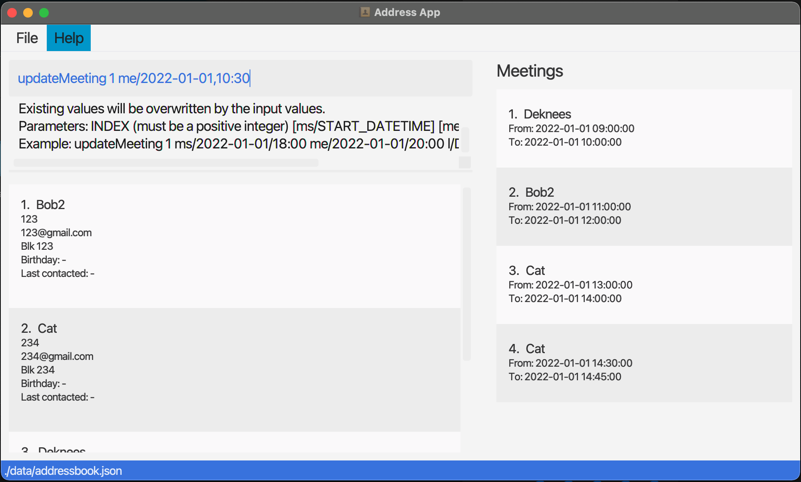

Step 5. The user executes `deleteMeeting 1` to delete the meeting.
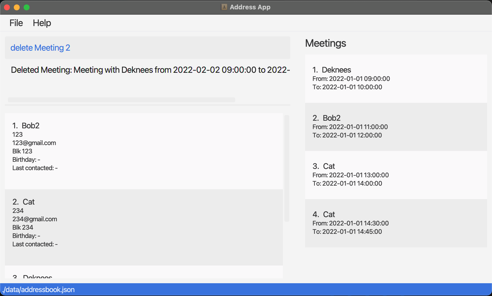

### Note features

#### Implementation

The new note feature is supported by a new model `Note`. Each `Client` object contains a `Note` attribute to specify a specific `Note` that the user wishes to record about the `Client`.

The `Note` model has a single attribute

1. `value` that represents the `String` value that is stored in the note.

The note feature supports the following operations:

- Adding a note - called via the `AddNoteCommand`

Given below is an example usage scenario and how the feature behaves:

Step 1: The user launches the application

Step 2: The user executes `addNote 1 nt/Likes to gym` to add a `Note` to the existing `Client` object that represents the first client in the list containing `"Likes to gym" as the value.

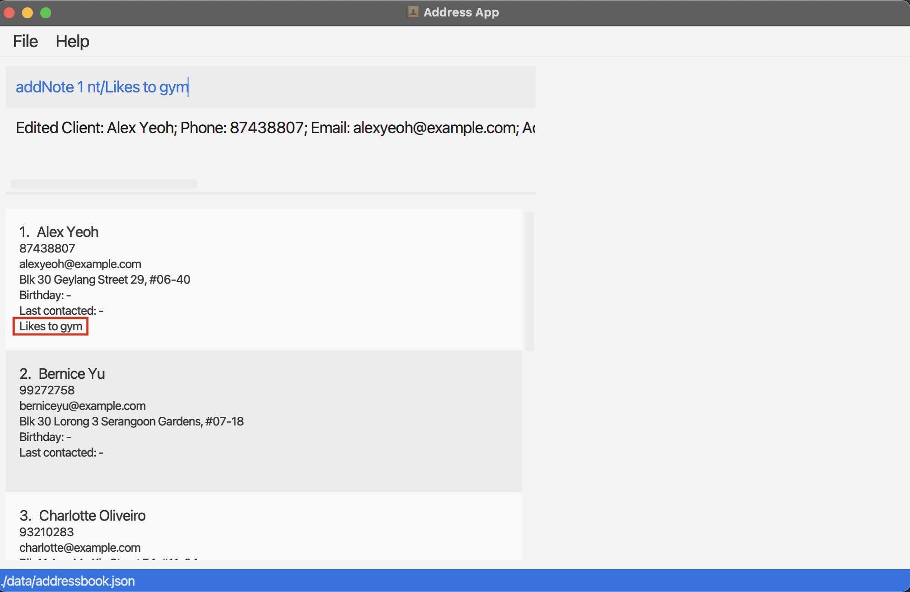

### Preference features

#### Implementation

The new preference feature is supported by a new model `PreferenceMap`

The `PreferenceMap` model has a single attribute. The existing `Client` model now contains a `PreferenceMap` representing all the preferences of the specific `Client`.

1. `preferences` that represents stores the key, value pairs of the preferenceKey and preferenceDetails

The preference feature supports the following operations:

- Adding of new preferences - called via the `AddPreferenceCommand`
- Deleting of existing preferences - called via the `DeletePreferenceCommand`

Given below is an example usage scenario and how the feature behaves:

Step 1: The user launches the application

Step 2: The user executes `addPref 1 pk/Drink pd/Bubble Tea` to add the Drink: Bubble Tea preference to the first client in the contact list. The `addPref` command calls the `addPref` command of the existing `Client` object that represents the first client in the list, and adds the `"Drink", "Bubble Tea"` key-value pair into the preferences of the specified `Client`.

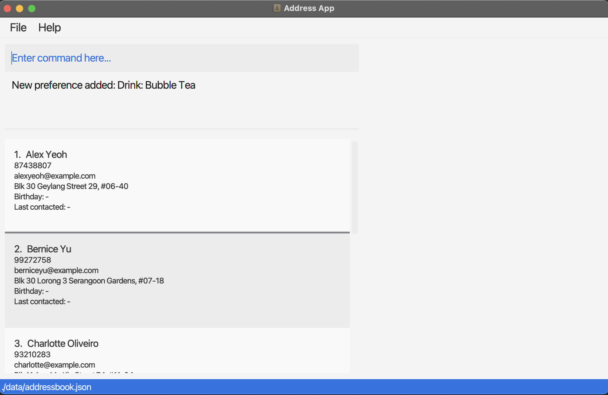

Step 3: If the user would like to remove the `"Drink", "Bubble Tea"` preference as specified in the `addPref` command in Step 2, they can execute `deletePref 1 pk/Drink` to remove the preference specified by the key `"Drink"` from the existing `Client` object represented at the index `1`.

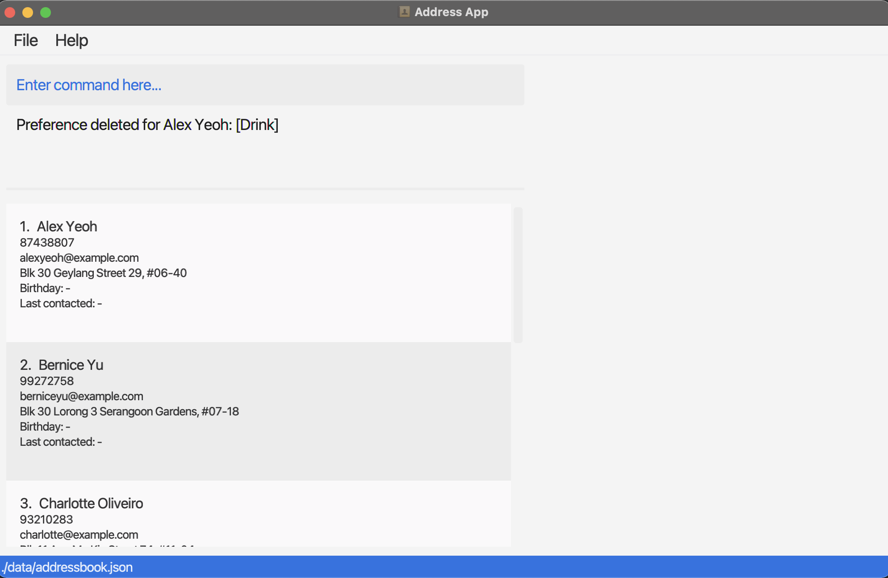

### Policy features

#### Implementation

The new meeting feature is supported by two new models `Policy` and `Premium`.

The `Policy` model has four attributes

1. `name` represents the name of the policy
2. `company` represents the name of the company which sells the policy
3. `policyManager` represents the name of the person who is managing the policy
4. `premium` represents the monthly premium payment for the policy

The policy features supports the following operations:

- Adding new policies - called via the `AddPolicyCommand`
- Editing policies - called via the `EditPolicyCommand`
- Deleting policies - called via the `DeletePolicyCommand`
- _In progress_: View all policies - called via the `ViewPoliciesCommand`

Given below is an example usage scenario and how the feature behaves:

Step 1. The user launches the application.

Step 2. The user executes `addPolicy 1 n/Medicare Plus c/Medicare pm/Zechary $/100` to add the Medicare Plus policy to the first client in the contact list. The `addPolicy` command instantiates a new `Policy` object which will be added to the existing `Client` object that represents the first client in the list.

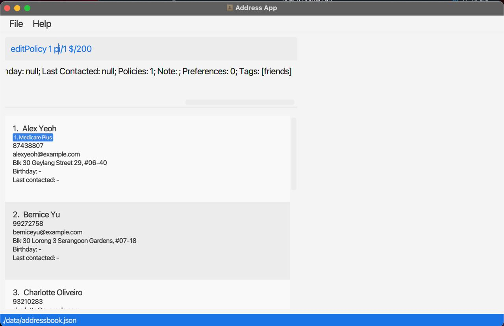

Step 3. The user executes `editPolicy 1 pi/1 $/200` to update the monthly premium of the first policy of the first client in the contact list from $100 up to $200.

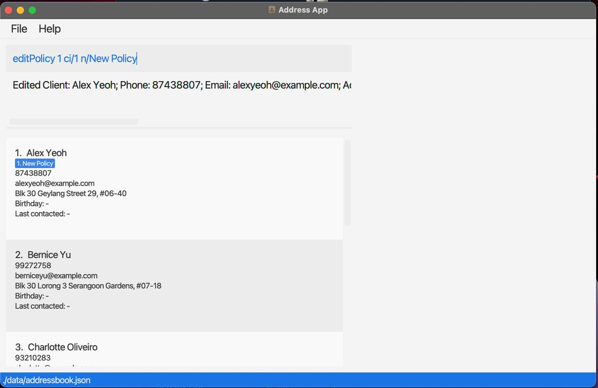

Step 4. The user executes `deletePolicy 1 pi/1` to delete the first policy of the first client in the contact list.

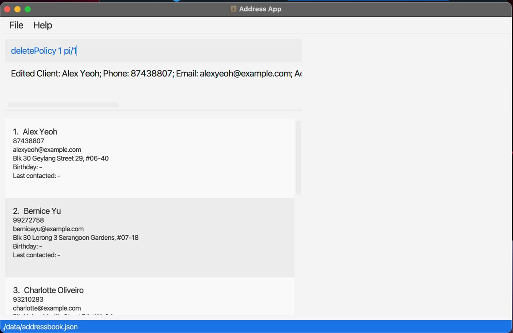

---

## **Documentation, logging, testing, configuration, dev-ops**

- [Documentation guide](Documentation.md)
- [Testing guide](Testing.md)
- [Logging guide](Logging.md)
- [Configuration guide](Configuration.md)
- [DevOps guide](DevOps.md)

---

## **Appendix: Requirements**

### Product scope

**Target user profile**:

- has a need to manage a significant number of client contacts
- prefer desktop apps over other types
- can type fast
- prefers typing to mouse interactions
- is reasonably comfortable using CLI apps

**Value proposition**:

- easily contact clients
- arrange for meetups with clients in one place
- manage contacts faster than a typical mouse/GUI driven app

### User stories

Priorities: High (must have) - `* * *`, Medium (nice to have) - `* *`, Low (unlikely to have) - `*`

| Priority | As a …​                                    | I want to …​                                       | So that I can…​                                                        |
| -------- | ------------------------------------------ | -------------------------------------------------- | ---------------------------------------------------------------------- |
| `* * *`  | potential user                             | see the app populated with sample data             | see how the app will look like when it is in use                       |
| `* * *`  | new user                                   | see usage instructions                             | refer to instructions when I forget how to use the App                 |
| `* * *`  | user                                       | add a new client                                   |                                                                        |
| `* * *`  | user                                       | update a client                                    | handle changes in client details                                       |
| `* * *`  | user                                       | delete a client                                    | remove non-essential contacts                                          |
| `* * *`  | user                                       | view all the clients in my contact list            |                                                                        |
| `* * *`  | user                                       | find a client by name                              | locate details of clients without having to go through the entire list |
| `* * *`  | user                                       | schedule a meeting with a client                   |                                                                        |
| `* * *`  | user                                       | view my meeting schedule on a given today          | know what timings I will be occupied on that day                       |
| `* *`    | user                                       | get warnings if there are conflicts in my schedule | avoid scheduling clashing meetings                                     |
| `* *`    | user                                       | add notes about my clients                         | record details about clients                                           |
| `* *`    | user                                       | add details of my client's policies                | categorize clients by policies                                         |
| `* *`    | user                                       | update details of my client's policies             | accommodate changes such as change in monthly premium                  |
| `* *`    | user                                       | delete policies                                    | remove policies that clients have surrendered or terminated            |
| `* *`    | user                                       | record my client's individual preferences          | better cater to their needs                                            |
| `*`      | user with many clients in the address book | sort clients by name                               | locate a client easily                                                 |

_{More to be added}_

### Use cases

(For all use cases below, the **System** is `onlyFAs` and the **Actor** is the `user`, unless specified otherwise)

**Use case: Add a client**

**MSS**

1. User requests to add a client
2. onlyFAs prompts user to add data about a new client
3. User enters details of new client
4. onlyFAs adds the new client

Use case ends.

---

**Use case: Update a client's details**

**MSS**

1. User requests to edit a specific client in the list
2. onlyFAs prompts user to enter client's email
3. User enters client's email
4. onlyFAs prompts user to enter new details
5. User enters new details of client
6. onlyFAs edits the client details

   Use case ends.

**Extensions**

- 3a. The email does not belong to any client.
  - 3a1. onlyFAs shows an error message.
  - Use case resumes at step 2.

---

**Use case: Delete a client**

**MSS**

1.  User requests to list clients
2.  onlyFAs shows a list of clients
3.  User requests to delete a specific client in the list
4.  onlyFAs deletes the client

    Use case ends.

**Extensions**

- 2a. The list is empty.

  - Use case ends.

- 3a. The given index is invalid.
  - 3a1. onlyFAs shows an error message.
  - Use case resumes at step 2.

---

**Use case: Find a client by name**

**MSS**

1. User requests to search
2. onlyFAs prompts user to enter client name
3. User enters client name
4. onlyFAs displays matching client’s details

   Use case ends.

**Extensions**

- 2a. There are no matching clients.

  - Use case ends.

- 2b. There are multiple matching clients.
  - 2b1. onlyFAs lists all matching clients.
  - 2b2. User requests to view a specific client in the list.
  - Use case resumes at step 4.

---

**Use case: Schedule meeting with a client**

**MSS**

1. User requests to schedule meeting with client
2. onlyFAs prompts user to enter client email
3. User enters client email
4. onlyFAs prompts user to enter meeting details
5. User enters meeting details
6. onlyFAs requests for confirmation
7. User confirms
8. onlyFAs displays the confirmed client and meeting details

   Use case ends.

**Extensions:**

- 3a. The email does not belong to any client.

  - 3a1. onlyFAs shows an error message.
  - Use case resumes at step 2.

- 5a. onlyFAs detects a conflicting meeting in the schedule
  - 5a1. onlyFAs requests for user to enter another meeting time.
  - 5a2. User enters new meeting time.
  - Steps 5a1-5a2 are repeated until the data entered are correct.
  - Use case resumes from step 6.

---

**Use case: View my meeting schedule for today**

**MSS**

1. User requests to show meeting schedule
2. onlyFAs displays meetings for today.

   Use case ends.

**Extensions**

- 2a. There are no meetings today.
  - Use case ends.

### Non-Functional Requirements

1. Should work on any _mainstream OS_ as long as it has Java `11` or above installed.
2. Should be able to hold up to 1000 clients without a noticeable sluggishness in performance for typical usage.
3. Should be able to record at least 1000 meetings without a noticeable lag in data retrieval.
4. A user with above average typing speed for regular English text (i.e. not code, not system admin commands) should be able to accomplish most of the tasks faster using commands than using the mouse.

_{More to be added}_

### Glossary

- **Mainstream OS**: Windows, Linux, Unix, OS-X
- **Client**: A contact using the services of the user (a Financial Advisor).

---

## **Appendix: Instructions for manual testing**

Given below are instructions to test the app manually.

:information_source: **Note:** These instructions only provide a starting point for testers to work on;
testers are expected to do more *exploratory* testing.

### Launch and shutdown

1. Initial launch

   1. Download the jar file and copy into an empty folder

   1. Double-click the jar file Expected: Shows the GUI with a sample contact list containing 6 clients. The window size may not be optimum.

1. Saving window preferences

   1. Resize the window to an optimum size. Move the window to a different location. Close the window.

   1. Re-launch the app by double-clicking the jar file. 
      Expected: The most recent window size and location is retained.

1. _{ more test cases …​ }_

### Deleting a client

1. Deleting a client while all clients are being shown

   1. Prerequisites: List all clients using the `list` command. Multiple clients in the list.

   2. Test case: `deleteClient 1` 
      Expected: First contact is deleted from the list. Details of the deleted contact shown in the status message. Timestamp in the status bar is updated.

   3. Test case: `deleteClient 0` 
      Expected: No client is deleted. Error details shown in the status message. Status bar remains the same.

   4. Other incorrect delete commands to try: `delete`, `delete x`, `...` (where x is larger than the list size) 
      Expected: Similar to previous.

   5. _{ more test cases …​ }_

### Adding a policy

1. Adding a policy to a client in the contact list

   1. Prerequisites: There must be at least one client in the contact list.

   1. Test case: `addPolicy 1 n/Medicare Plus c/Medicare pm/Zechary $/100` 
      Expected: A blue tag entitled _Medicare Plus_ should appear under the name of the first client in the contact list. Status message shows that the number of policies of the client is 1 higher than before.

   1. Test case: `addPolicy 1 n/Medicare Plus` 
      Expected: No policy is added. Error details shown in the status message.

   1. Other incorrect delete commands to try: `addPolicy`, `addPolicy x n/Medicare Plus c/Medicare pm/Zechary $/100`, `...` (where x is larger than the list size) 
      Expected: Similar to previous.

1*{ more test cases …​ }*

### Editing a policy

1. Editing a policy of a client in the contact list

   1. Prerequisites: There must be at least one client in the contact list with at least one policy.

   1. Test case: `editPolicy 1 pi/1 n/New Policy` 
      Expected: The first blue tag under the name of the first client in the contact list should now be entitled _New Policy_. Status message shows that the number of policies of the client is the same as before.

   1. Test case: `editPolicy 1 pi/1` 
      Expected: No policy is edited. Error details shown in the status message.

   1. Other incorrect delete commands to try: `editPolicy`, `editPolicy x pi/y`, `...` (where x is larger than the list size or y is larger than client's policy list size) 
      Expected: Similar to previous.

1*{ more test cases …​ }*

### Deleting a policy

1. Deleting a policy of a client in the contact list

   1. Prerequisites: There must be at least one client in the contact list with at least one policy.

   1. Test case: `deletePolicy 1 pi/1` 
      Expected: The first blue tag under the name of the first client in the contact list should disappear. Status message shows that the number of policies of the client is 1 less than before.

   1. Test case: `deletePolicy 1` 
      Expected: No policy is deleted. Error details shown in the status message.

   1. Other incorrect delete commands to try: `deletePolicy`, `deletePolicy x pi/y`, `...` (where x is larger than the list size or y is larger than client's policy list size) 
      Expected: Similar to previous.

1*{ more test cases …​ }*

### Saving data

1. Dealing with missing/corrupted data files

   1. _{explain how to simulate a missing/corrupted file, and the expected behavior}_

1. _{ more test cases …​ }_
