## Introduction - What is onlyFAs?

<strong>onlyFAs</strong> is a Customer Relationship Management (CRM) application targeted at *upcoming* financial
advisors looking to *maintain* and *develop* good relationships with *current* and *potential* clients.

### What can onlyFAs do?

It allows users to:
1. Record all clients in the app
2. Manage their clients' personal details
3. Manage the investment portfolios of each client
4. Track the meetings the user has with their clients
5. Track the date that each client was last contacted

Currently, financial advisors might have to rely on apps like Google Calendar or Microsoft Excel, and do not have a
dedicated platform catered to helping them manage their clientele. This is where *onlyFAs* bridges the gap.

## Table of Contents

- [Quick start](#quick-start)
- [User Interface Layout](#user-interface-layout)
- [Features](#features)
  - [Basic Features](#u-basic-features-u)
    1. [Viewing help: `help`](#viewing-help--help)
    2. [Exiting the program: `exit`](#exiting-the-program-exit)
    3. [Accessing the Tutorial: `tutorial`](#accessing-the-tutorial-tutorial)
    4. [Saving the data](#saving-the-data)
    5. [Editing the data file](#editing-the-data-file)
  - [Client Features](#u-client-features-u)
    1. [Add client: `addClient`](#add-client-addclient)
    2. [View client: `viewClient`](#view-client-viewclient)
    3. [Find client by name: `findClient`](#find-client-by-name-findclient)
    4. [Sort Clients: `sortClients`](#sort-clients-sortclients)
    5. [Filter Clients: `filterClients`](#filter-clients-filterclients)
    6. [Reset Filter/Sort & View All Clients: `clients`](#reset-filtersort--view-all-clients)
    7. [Edit client: `editClient`](#edit-client-editclient)
    8. [Delete client: `deleteClient`](#delete-client-deleteclient)
    9. [Clearing all entries: `clear`](#clearing-all-entries-clear)
    10. [Update last contacted of client: `contacted`](#update-last-contacted-of-client-contacted)
    11. [Add/edit notes for client : `addNote`](#addedit-notes-for-client--addnote)
    12. [Delete note from client: `deleteNote`](#delete-note-from-client-deletenote)
    13. [Add/edit preferences to client: `addPref`](#addedit-preferences-to-client-addpref)
    14. [Delete preferences from client: `deletePref`](#delete-preferences-from-client-deletepref)
  - [Policy Features](#u-policy-features-u)
    1. [Add policy: `addPolicy`](#add-policy-addpolicy)
    2. [Edit policy: `editPolicy`](#edit-policy-editpolicy)
    3. [Delete policy: `deletePolicy`](#delete-policy-deletepolicy)
  - [Meeting Features](#u-meeting-features-u)
    1. [Add meeting: `addMeeting`](#add-meeting-addmeeting)
    2. [View All Meetings: `meetings`](#view-meetings-meetings)
    3. [Edit Meeting Details: `editMeeting`](#edit-meeting-details-editmeeting)
    4. [Delete Meeting: `deleteMeeting`](#delete-meeting-deletemeeting)
    5. [Close Meeting: `closeMeeting`](#close-meeting-closemeeting)
- [FAQ](#faq)
- [Command summary](#command-summary)

---

## Quick start

1. Ensure you have Java `11` or above installed in your Computer.

1. Download the latest `onlyfas.jar` from [here](https://github.com/AY2122S2-CS2103T-W13-4/tp/releases).

1. Copy the file to the folder you want to use as the **home folder** for _onlyFAs_.

1. Double-click the file to start the app. The GUI similar to the below should appear in a few seconds. Note how the app contains some sample data. 
   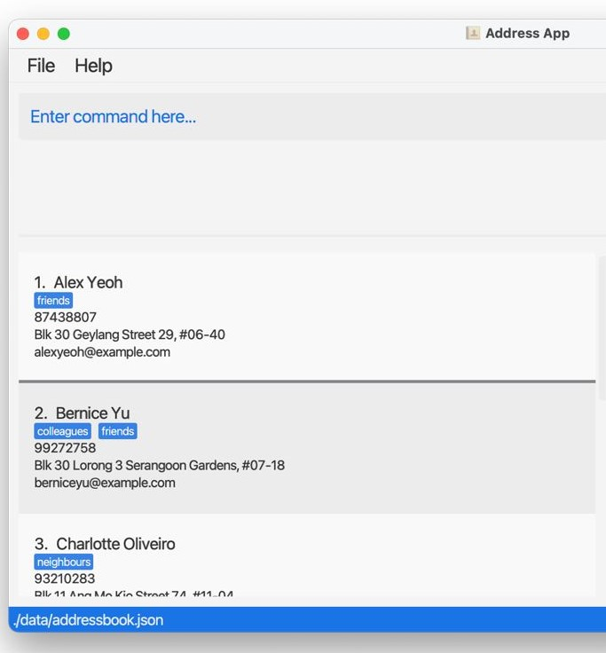

1. Type the command in the command box and press Enter to execute it. e.g. typing **`help`** and pressing Enter will open the help window. 
   Some example commands you can try:

    - **`list`** : Lists all contacts.

    - **`addClient`**`n/John Doe p/98765432 e/johnd@example.com a/John street, block 123, #01-01` : Adds a client
      named `John Doe` to your contact list.

    - **`delete`**`3` : Deletes the 3rd contact shown in the current list.

    - **`clear`** : Deletes all contacts.

    - **`exit`** : Exits the app.

1. Refer to the [Features](#features) below for details of each command.

---

## User Interface Layout

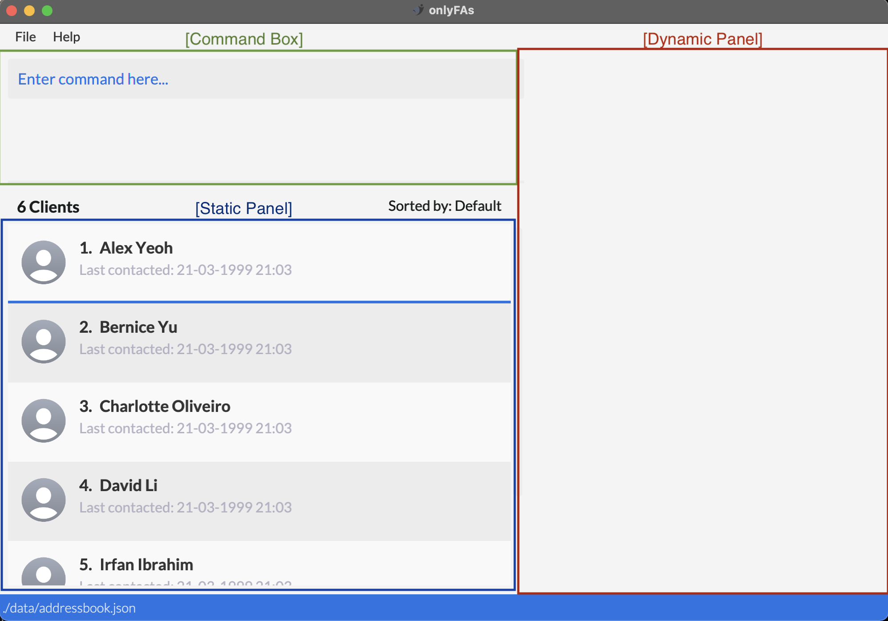

## Features

### Guidelines for Command Format

- Words in `UPPER_CASE` are the parameters to be supplied by the user. 
  e.g. in `add n/NAME`, `NAME` is a parameter which can be used as `add n/John Doe`.

- If the command requires a reference to an INDEX, any leading zeroes (`01`, `001`) will be ignored. 
  e.g. in `viewClient 1`, `1` is the INDEX of the specified client, and can be referenced as `01` or `0001` with no regard to the leading zeroes

- Items in square brackets are optional. 
  e.g. `n/NAME [t/TAG]` can be used as `n/John Doe t/friend` or as `n/John Doe`.

- Items with `…`​ after them can be used multiple times including zero times. 
  e.g. `[t/TAG]…​` can be used as ` ` (i.e. 0 times), `t/friend`, `t/friend t/family` etc.

- Parameters can be in any order. 
  e.g. if the command specifies `n/NAME p/PHONE_NUMBER`, `p/PHONE_NUMBER n/NAME` is also acceptable.

- If a parameter is expected only once in the command but you specified it multiple times, only the last occurrence of the parameter will be taken. 
  e.g. if you specify `p/12341234 p/56785678`, only `p/56785678` will be taken.

- Extraneous parameters for commands that do not take in parameters (such as `help`, `list`, `exit` and `clear`) will be ignored. 
  e.g. if the command specifies `help 123`, it will be interpreted as `help`.

### <u> Basic Features </u>

### Viewing help : `help`

Shows a message explaining how to access the help page.

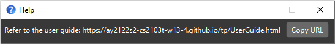

Format: `help`

### Exiting the program: `exit`

Exit the program.

Format: `exit`

### Accessing the tutorial: `tutorial`

Opens the tutorial for the program.

#### Sample Input:

`tutorial`

#### Expected Output:

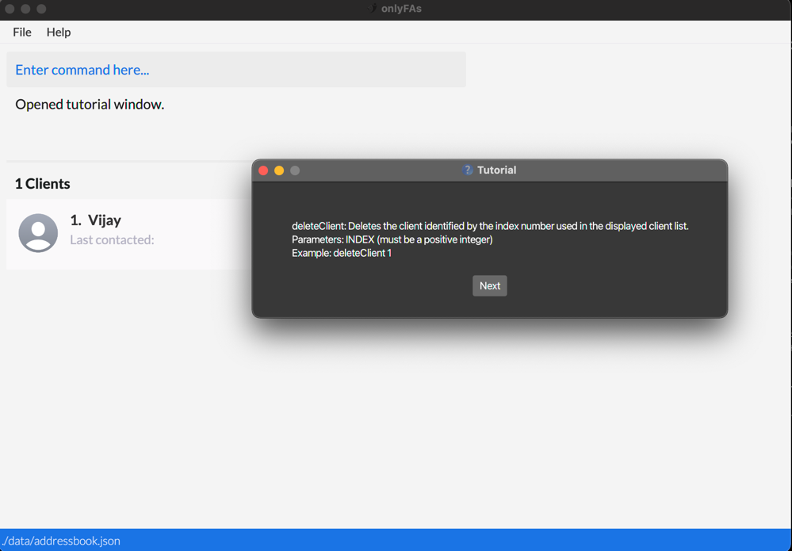

### Saving the data

onlyFAs' data is saved in the hard disk automatically after any command that changes the data. There is no need to save manually.

### Editing the data file

onlyFAs' data is saved in a JSON file `[JAR file location]/data/data.json`. Advanced users are welcome to update data directly by editing that data file.

:exclamation: **Caution:**
If your changes to the data file makes its format invalid, onlyFAs will discard all data and start with an empty data file at the next run.

### <u> Client Features </u>

### Add client: `addClient`

Adds a client to the list of managed clients.

Format: `addClient n/NAME p/PHONE_NUMBER [e/EMAIL] [a/ADDRESS] [b/BIRTHDAY] [lc/LAST_CONTACTED]`

- `EMAIL` must be in the format `"local-part@domain"` and adhere to the following constraints
    - The `local-part` should only contain alphanumeric characters and the special characters `+_.-`.
    - The `local-part` cannot start or end with these special characters.
    - This is followed by an `@` and then a domain name. The domain name is made up of labels separated by periods.
    - The domain name must:
        - end with a domain label at least 2 characters long
        - have each domain label start and end with alphanumeric characters
        - have each domain label consist of alphanumeric characters, separated only by hyphens, if any.
- `BIRTHDAY` must be in `dd-MM-yyyy` format.
- `LAST_CONTACTED` must be in `dd-MM-yyyy HH:mm` format.

#### Sample Input:

`addClient n/Vijay Narayanan p/91234567 e/vijay@email.com a/210 Street 3 b/21-03-1999 lc/21-03-2022 21:03` 

#### Expected Output: `Client` with `NAME: Vijay`

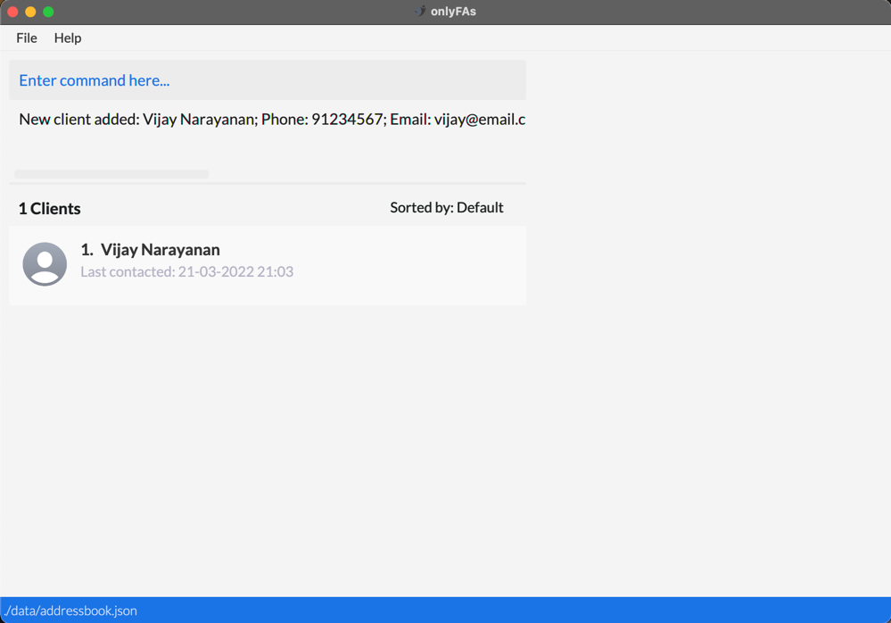

### View client: `viewClient`

View a client in your address book. The client to be viewed will appear on the `Dynamic Panel` Section

Format: `viewClient INDEX`

#### Sample Input:

`viewClient 1`

#### Expected Output: `Client` at `INDEX: 1` is displayed in the `Dynamic Panel`

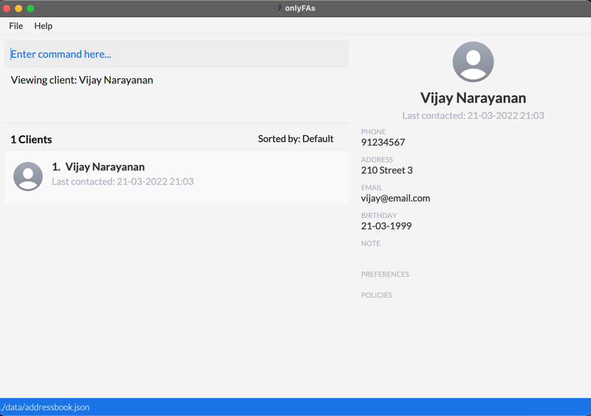

### Find client by name: `findClient`

Format: `findClient NAME`

#### Sample Input:

`findClient Alex`

#### Expected Output:

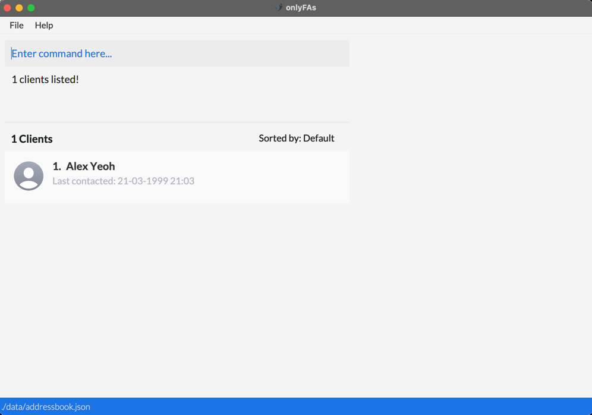

### Sort clients: `sortClients`

Retrieve a sorted list of clients based on the provided attribute and sort direction.

Format: `sortClients [ATTRIBUTE] [dir/SORT_DIRECTION]`

Supported attributes:
1. `numPolicies`, clients will be sorted based on the number of policies that they have.
2. `premium`, clients will be sorted based on their total premium sum for all their policies.
3. `lastContacted` clients will be sorted based on when they were last contacted.

Note to Users:

1. Sort direction refers to either `asc` (short for ascending) or `desc` (short for descending).
2. If no sort direction is provided, the default sort direction will be `desc`
3. If no attribute is provided, the list of clients will be sorted by default in the order that the clients were added
   to the list.

#### Sample Input 1: Sorting clients by the number of `Policies` that they have

`sortClients numPolicies`

#### Expected Output: `Client` list in the `Static Panel` is sorted in `desc` order

#### Sample Input 2: Sorting clients by the number of `Policies` that they have in `asc` order

`sortClients numPolicies dir/asc`

#### Expected Output: `Client` list in the `Static Panel` is sorted in `asc` order

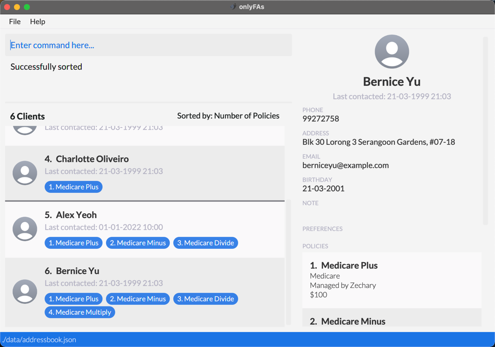

Other Examples:

- `sortClients`
- `sortClients numPolicies`
- `sortClients premium`
- `sortClients lastContacted`

### Filter clients: `filterClients`

Retrieve a filtered list of clients based on the provided operator and value.

Format: `filterClients ATTRIBUTE op/OPERATOR v/VALUE`

Note to Users:

The `filterClients` command is a complex command involving 3 parameters:

1. Attribute: the attribute to be filtered on

   Supported attributes: `birthMonth`, `age`, `premium`, `company`

2. Operator: the desired filter range

   Supported operators: `greaterorequal`, `greater`, `equal`, `lesser`, `lesserorequal`
    * Note: The only operator supported for `company` is `equal`

3. Value: the value to be filtered around

- `birthMonth`: Accepts text inputs represent months of the year. Example: `february`, `march`
- `age`: Accepts integer values. Example: `25`, `27`
- `premium`: Accepts integer values. Example: `25`, `27`
- `company`: Accepts text inputs represent companies. Example: `Great Eastern`, `AAM`

#### Sample Input 1: Filtering clients to retrieve those with `age: 23`

`filterClients age op/equal v/23`

#### Expected Output: `Client` list is filtered to retrieve those with `age: 23`

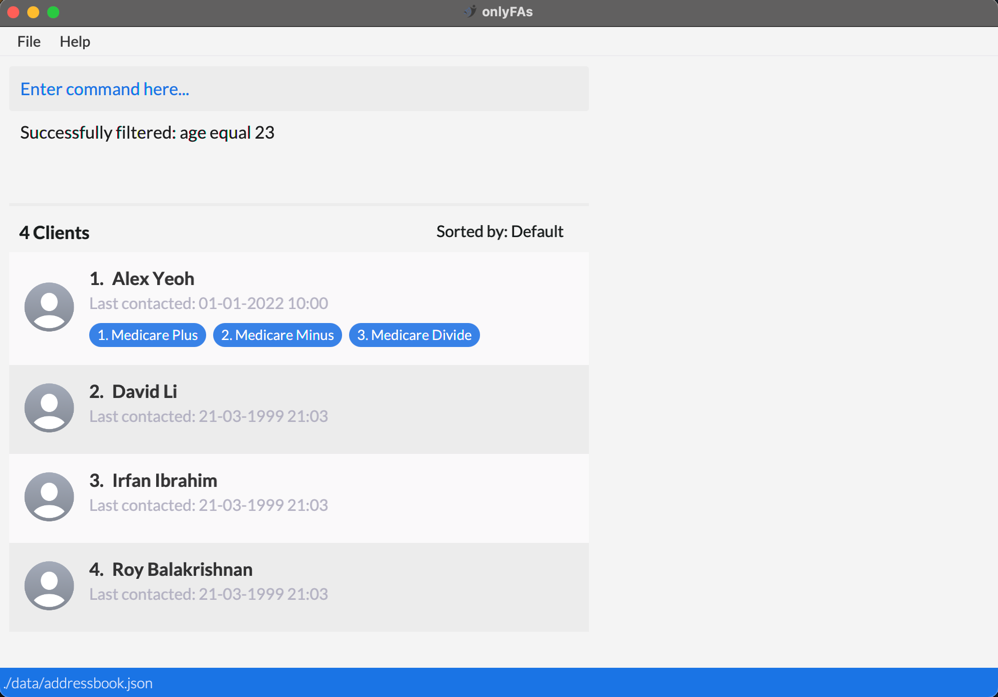

#### Sample Input 2: Filtering clients to retrieve those with `birthMonth` before `march`

`filterClients birtMonth op/lesser v/march`

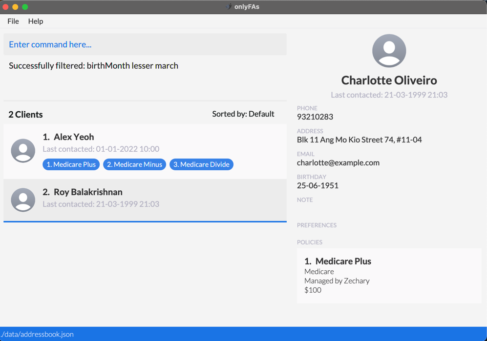

Other Examples:

1. `filterClients age op/equal v/25`: Retrieves all clients of `age` = `25`
2. `filterClients birthMonth op/lesser v/february`: Retrieves all clients with birthdays before `february`
3. `filterClients premium op/greater v/10000` Retrieves all clients that pay at least $`10000` in `premium`s
   annually
4. `filterClients company op/equal v/Great Eastern` Retrieves all clients who own at least one policy from `Great
   Eastern`

#### NOTE: `filterClients` and `sortClients` cannot be used simultaneously. Reset with `clients` before switching between filter and sort views.

### Reset Filter/Sort & View All Clients

#### Sample Input:

`clients`

#### Expected Output:

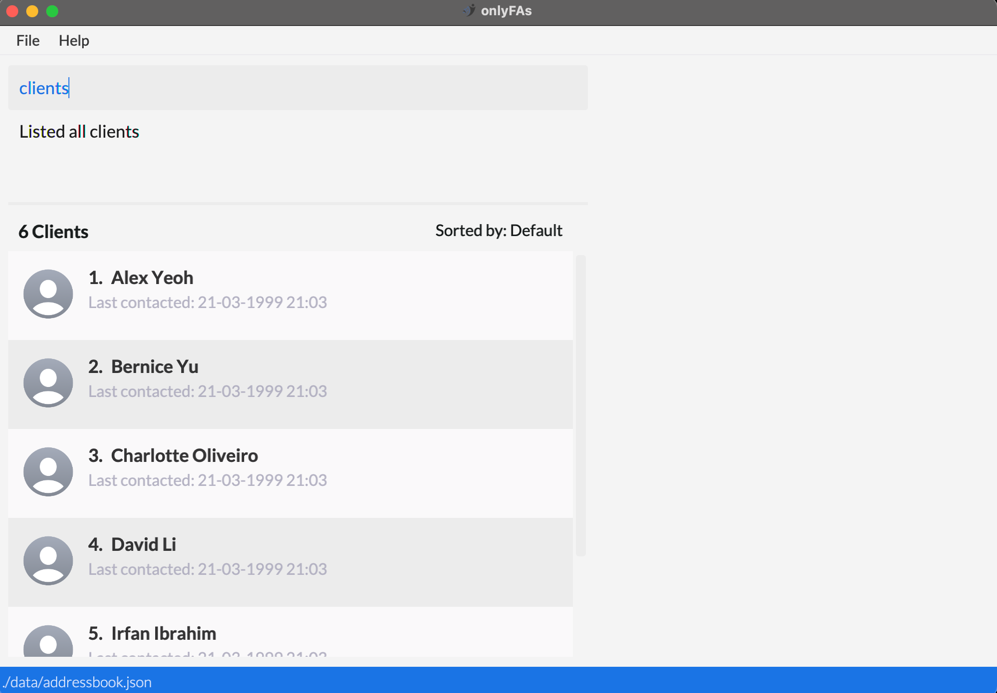

### Edit client: `editClient`

Edit a client in your address book.

Format: `editClient INDEX [n/NEW_NAME] [p/NEW_PHONE_NUMBER] [e/NEW_EMAIL] [a/NEW_ADDRESS] [b/NEW_BIRTHDAY]
[lc/NEW_LAST_CONTACTED]`

- `NEW_BIRTHDAY` must be in `dd-MM-yyyy` format.
- `NEW_LAST_CONTACTED` must be in `dd-MM-yyy HH:mm` format.

#### Sample Input:

`editClient 1 n/Shem Maleriado p/81234567 e/shem@email.com a/210 Avenue 1 b/21-01-1999 lc/21-03-2022 21:03`

#### Expected Output: `Client` at `INDEX: 1` is edited based on input parameters as seen in the `Dynamic Panel`

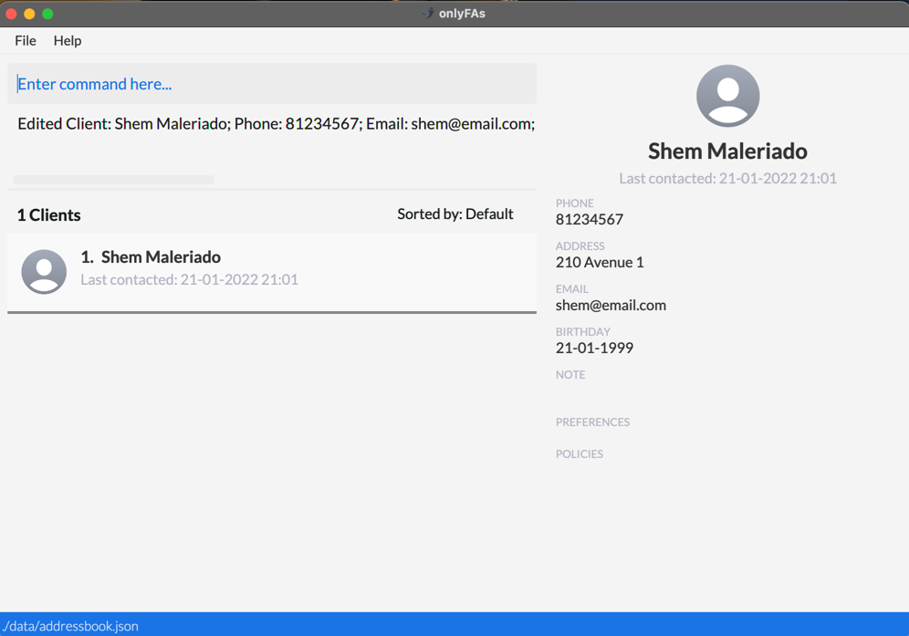

### Delete client: `deleteClient`

Delete a client from your address book.

Format: `deleteClient INDEX`

#### Sample Input:

`deleteClient 1`

#### Sample Output: `Client` at `INDEX: 1` is removed from the application

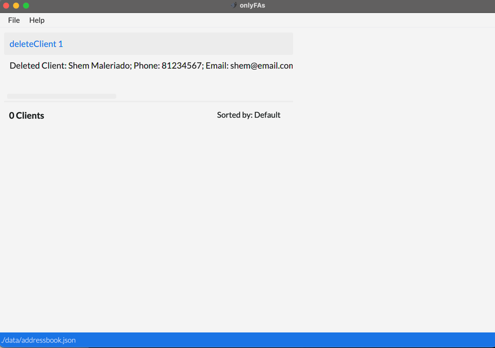

### Clearing all entries: `clear`

Clear all entries in onlyFAs.

#### Sample Input:

`clear`

#### Expected Output:

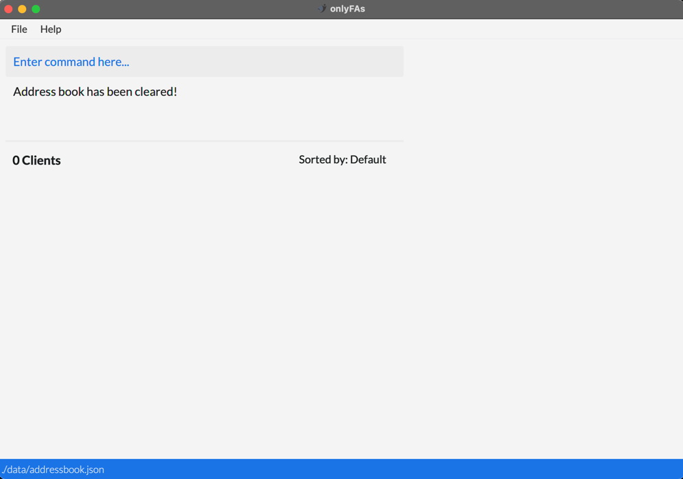

**NOTE: This command <u>cannot</u> be undone. Please use it with caution**

### Update last contacted of client: `contacted`

Updates the last contacted datetime of a client.

Format: `contacted INDEX lc/DATETIME`

#### Sample Input:

- `contacted 1 lc/21-03-2022 21:03`

#### Sample Output:

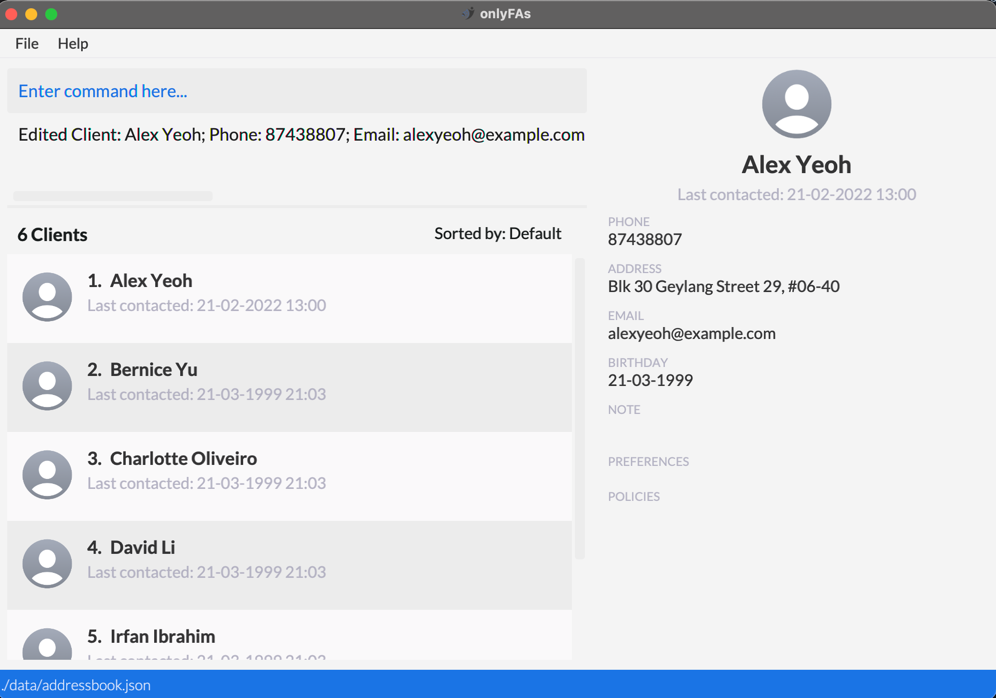

### Add/edit Notes for client : `addNote`

Adds a plaintext note to a specific client. If the client already has an existing note, **replaces** that note with the
note specified from this command.

Format: `addNote INDEX nt/NOTE`

#### Sample Input 1: Adding a new Note to a Client

`addNote 1 nt/Commando NSF with high risk of injury`

#### Expected Output: New Note added to `Client` at `INDEX: 1`

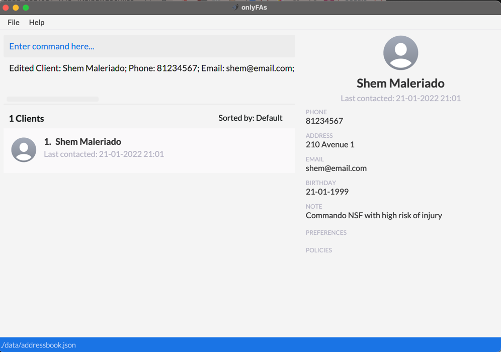

#### Sample Input 2: Editing existing Note on Client

`addNote 2 nt/Look up on policies for emergency care`

#### Expected Output: Existing Note on `Client` at `INDEX: 1` is overwritten

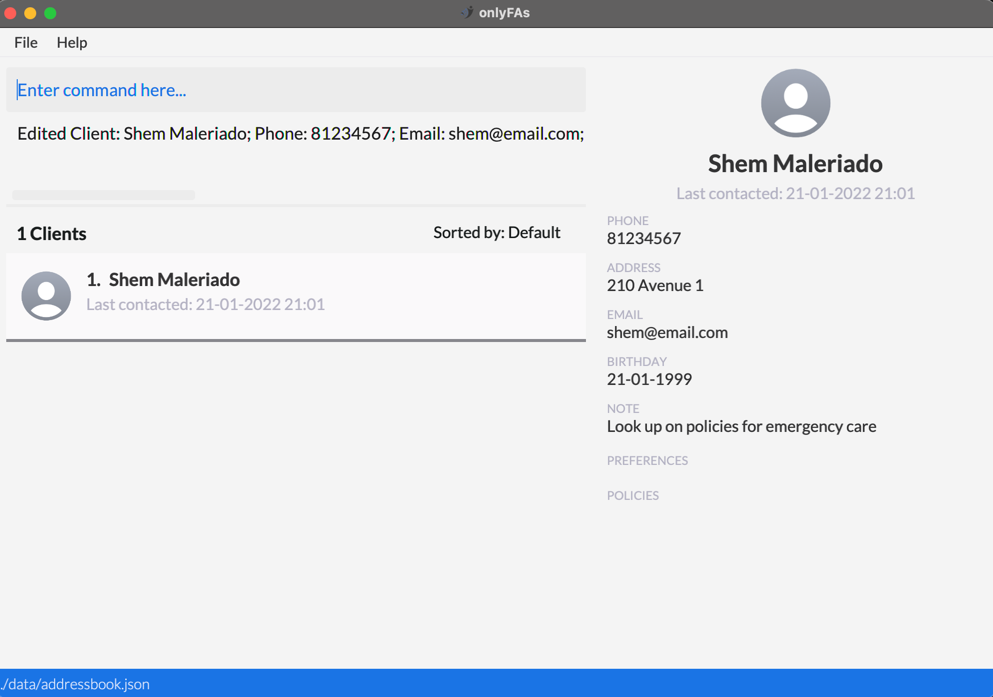

### Delete note from client: `deleteNote`

Delete the note of a specific client.

Format: `deleteNote INDEX`

#### Sample Input:

`deleteNote 1`

#### Expected Output

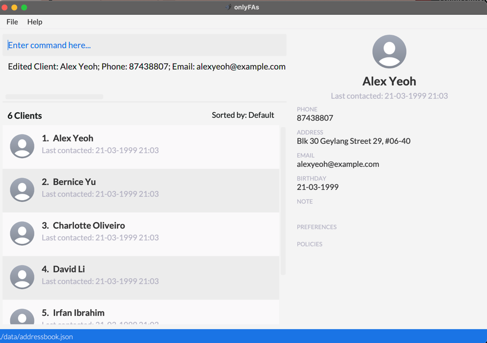

### Add/Edit preferences to client: `addPref`

Adds a preference to a specific client. If a preference already exists in that category, **replaces** that preference
with the preference specified by this command

Format: `addPref INDEX cat/CATEGORY pref/PREFERENCE`

#### Sample Input 1: Adding a new preference to Client

`addPref 1 cat/Drink pref/Coke`

#### Expected Output:

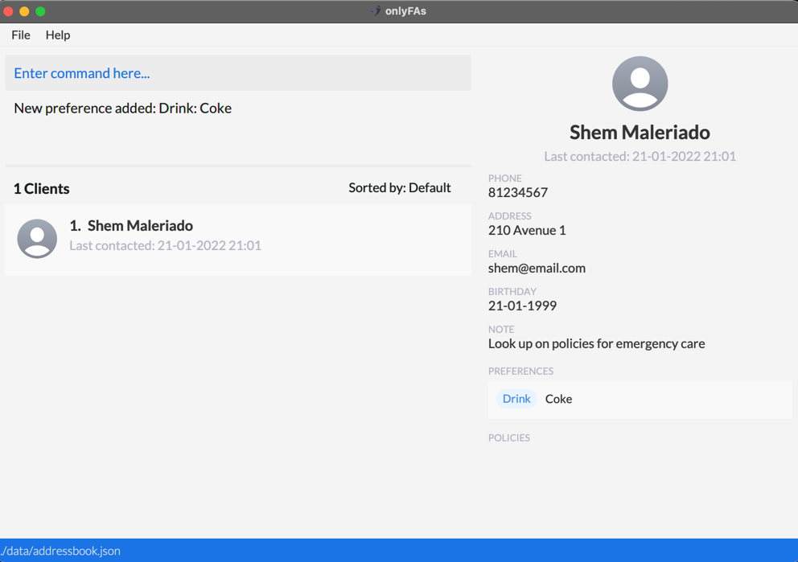

#### Sample Input 2: Editing an existing preference on Client

`addPref 2 cat/Drink pref/Beer`

#### Expected Output: `cat/Drink` Preference of `Client` at `INDEX: 2` is overwritten

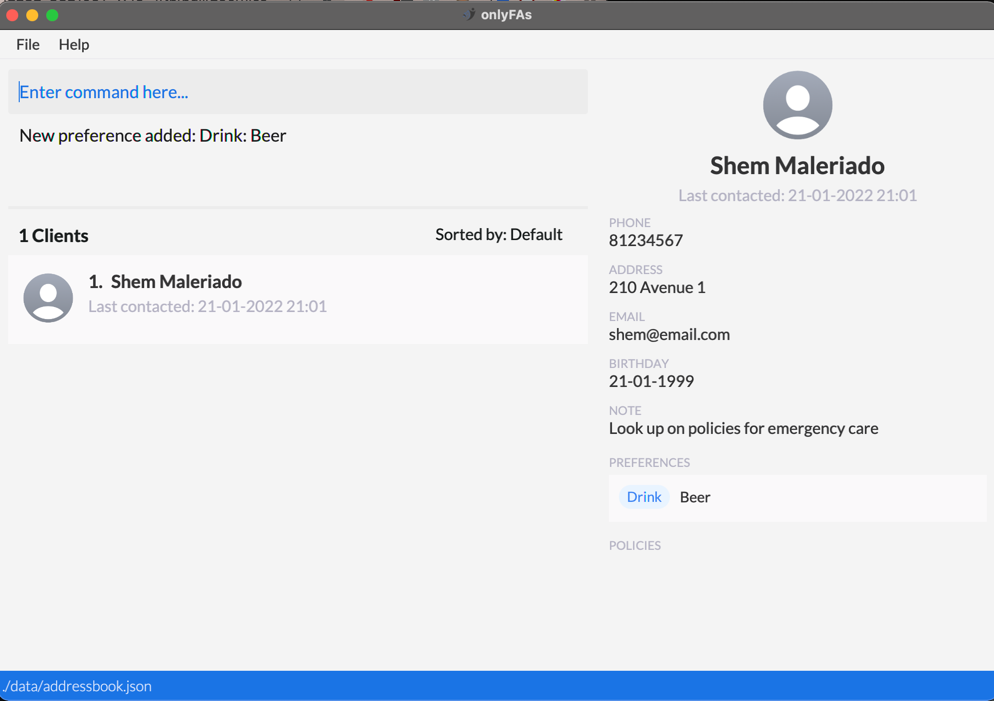

### Delete preferences from client: `deletePref`

Deletes the preference from the specified client.

Format: `deletePref INDEX cat/CATEGORY`

#### Sample Input: Deleting a preference from the Client

`deletePref 1 cat/Drink`

#### Expected Output: `cat/Drink` Preference of `Client` at `INDEX: 1` is deleted

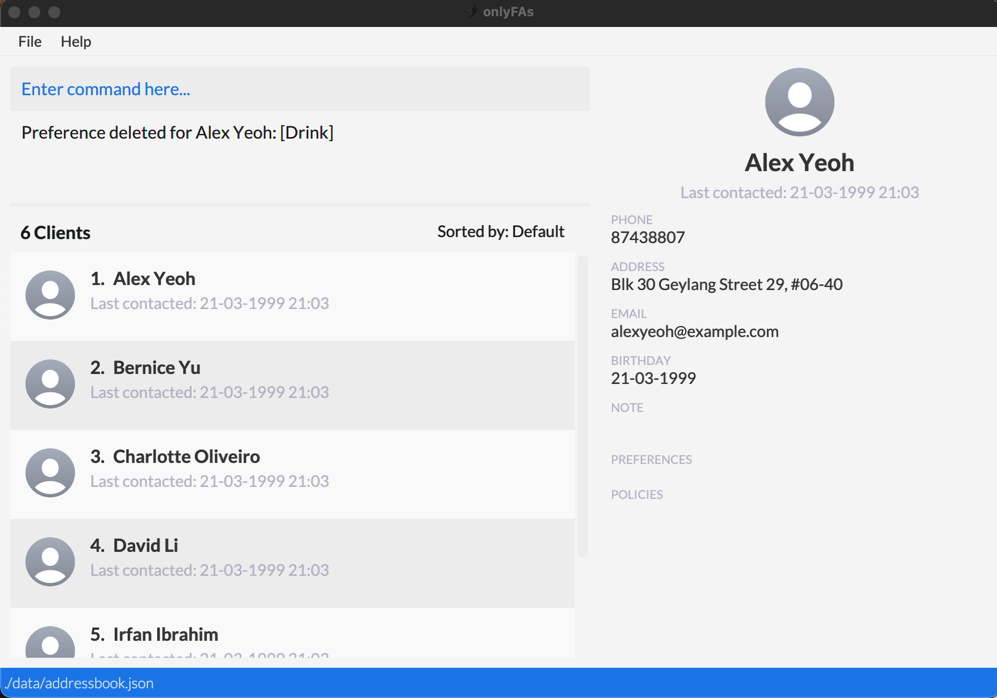

### <u> Policy Features </u>

### Add policy: `addPolicy`

Adds an insurance policy to a specified client

Format: `addPolicy INDEX n/POLICY_NAME c/COMPANY pm/POLICY_MANAGER_NAME $/PREMIUM_AMOUNT`

#### Sample Input:

`addPolicy 1 n/Medicare Plus c/Medicare pm/Zechary $/100`

#### Expected Output: `Policy` is added to `Client` at `INDEX: 1` and can be viewed under the `Policies` Section of the `Dynamic Panel`

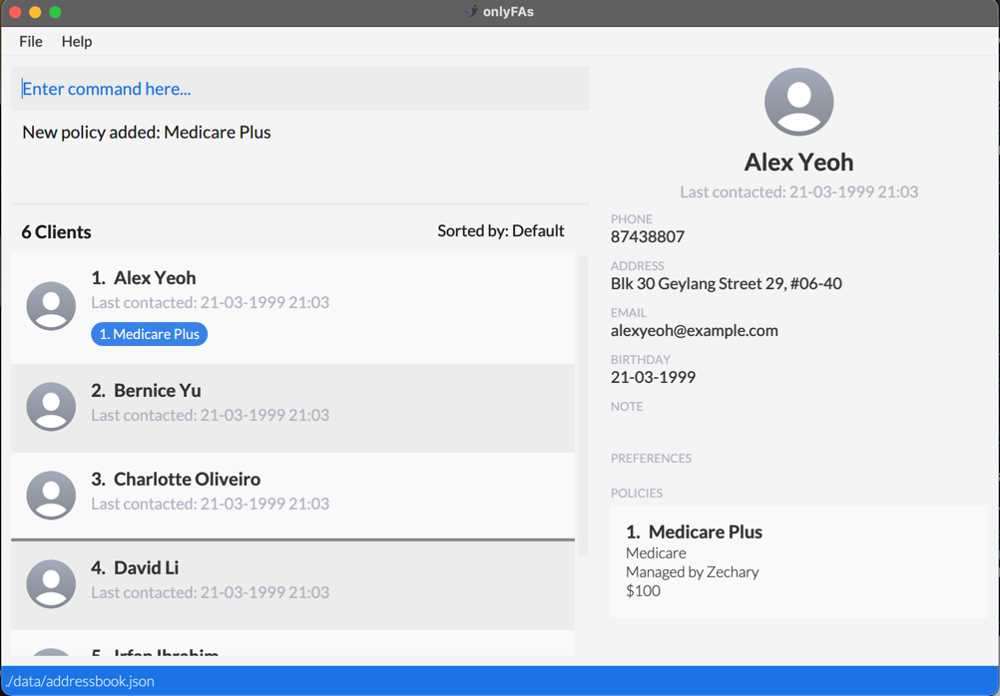

### Edit policy: `editPolicy`

Updates an insurance policy for a specified client

Format: `editPolicy INDEX pi/POLICY_INDEX [n/POLICY_NAME] [c/COMPANY] [pm/POLICY_MANAGER_NAME] [$/PREMIUM_AMOUNT]`

#### Sample Input: Editing premium value of policy

`editPolicy 1 pi/1 $/200`

#### Expected Output: Premium value of policy at `pi/1` of Client` at `INDEX: 1` is edited

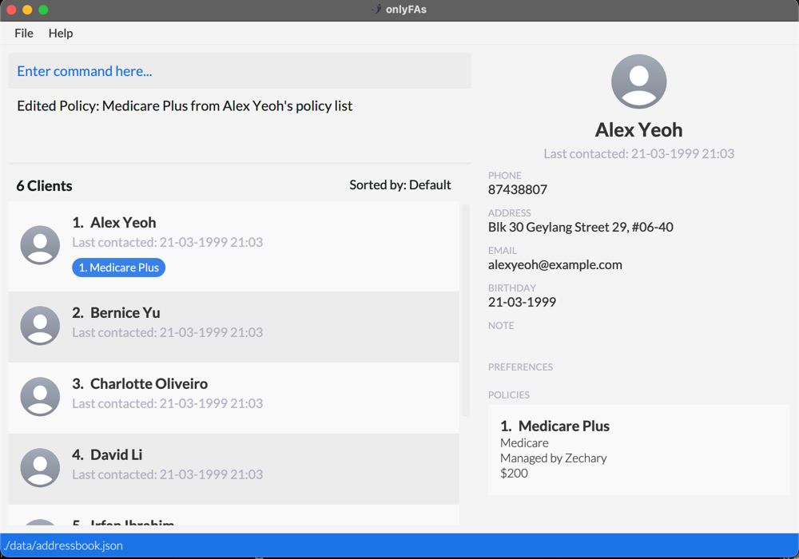

### Delete policy: `deletePolicy`

Deletes an insurance policy from a specified client

Format: `deletePolicy INDEX pi/POLICY_INDEX`

#### Sample Input:

`deletePolicy 1 pi/1`

#### Expected Output: `Policy` at `pi/1` of `Client` at `INDEX: 1` is deleted

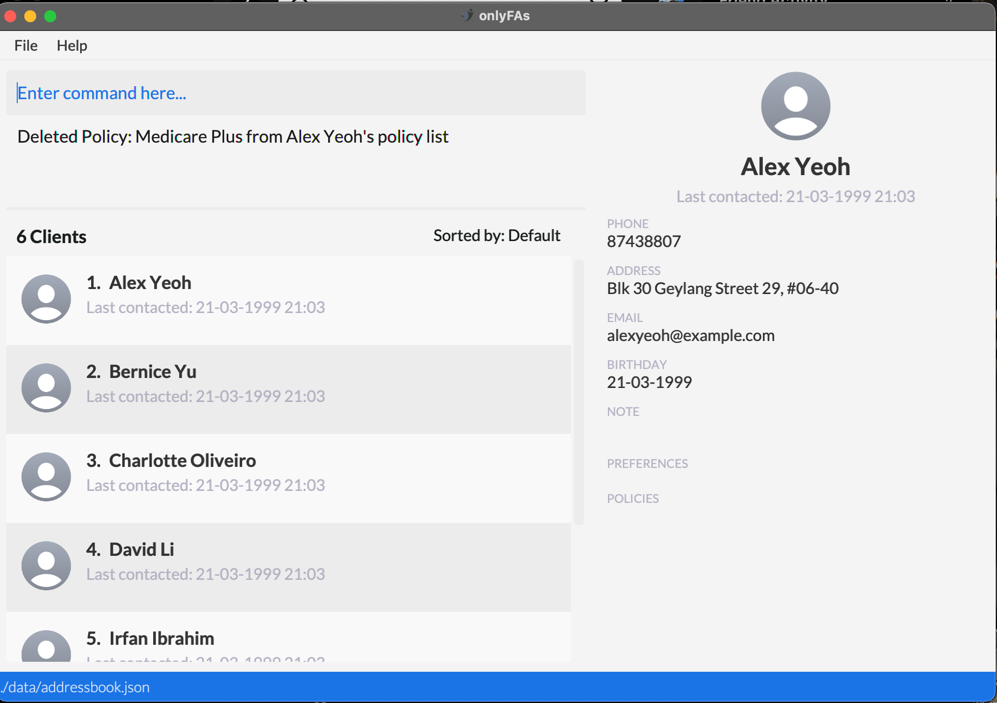

### <u> Meeting Features </u>

### Add meeting: `addMeeting`

Add a meeting to your schedule with a specified client.

Format: `addMeeting INDEX ms/START_DATETIME me/END_DATETIME [l/LABEL]`

- `START_DATETIME` and `END_DATETIME` must be in `dd-MM-yyyy HH:mm` format
- Use `meetings all/` to view your new meeting in the meeting panel on the right

#### Sample Input 1: Adding a meeting without the `l/LABEL` parameter

`addMeeting 1 ms/01-01-2022 11:00 me/01-01-2022 12:00`

#### Expected Output: `Meeting` is added

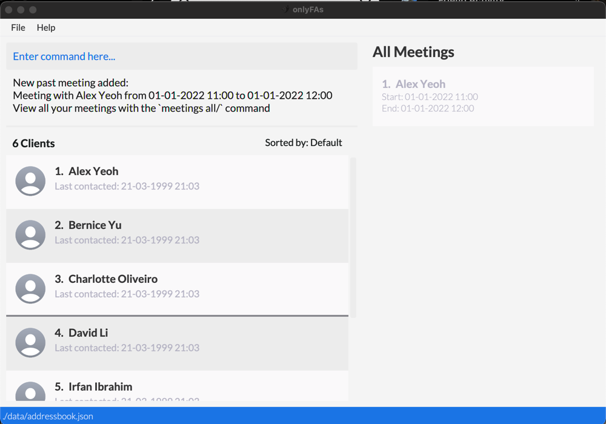

#### Sample Input 2: Adding a meeting with the `l/LABEL parameter`

`addMeeting 2 ms/27-12-2022 16:00 me/27-12-2022 17:00 l/Dinner`

#### Expected Output: `Meeting` is added and `l/LABEL` is visible in the `Dynamic Panel`

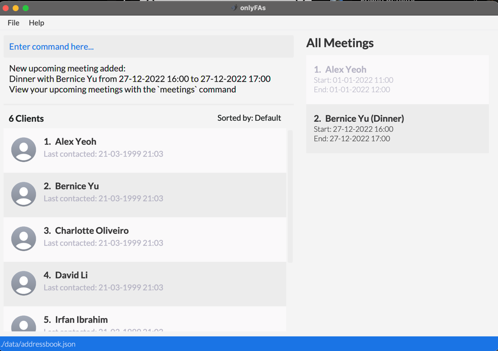

### View Meetings: `meetings`

Shows upcoming or all meetings.

- If an index is provided, only shows meetings with the specified client.
- If the `all/` flag is omitted, **ONLY** shows upcoming meetings (meetings that start today or in the future).
- If the `all/` flag is provided, shows all meetings instead of just upcoming meetings.

Format: `meetings [INDEX] [all/]`

#### Sample Input 1: Viewing <u>upcoming</u> meetings

`meetings`

#### Expected Output: All <u>Upcoming Meetings</u> can be viewed in the panel on the right

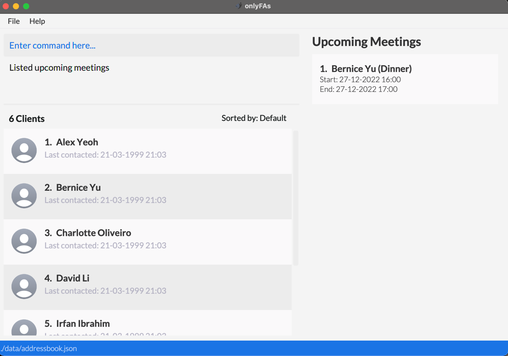

#### Sample Input 2: View <u>all</u> meetings

`meetings all/`

#### Expected Output: All <u>Past</u> and <u>Upcoming</u> Meetings can be viewed in the panel on the right

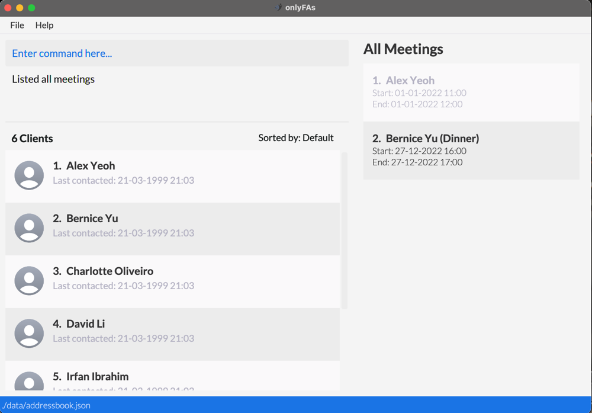

#### Sample Input 3: View meetings of specific Client

`meetings 2`

#### Expected Output: All <u>Upcoming</u> Meetings with `Client 2` can be viewed in the panel on the right

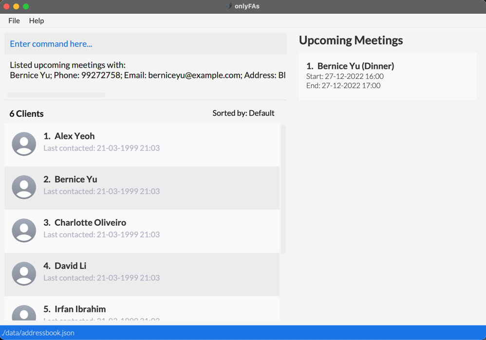

### Edit Meeting Details: `editMeeting`

Edit details of a specified meeting.

Format: `editMeeting INDEX [ms/NEW_START_DATETIME] [me/NEW_END_DATETIME] [l/NEW_LABEL]`
- `NEW_START_DATETIME` and `NEW_END_DATETIME` must be in `dd-MM-yyyy HH:mm` format

#### Sample Input:

`editMeeting 1 ms/01-01-2022 08:00 me/01-01-2022 10:00 l/Lunch`

#### Expected Output: Meeting is edited as seen in the `Dynamic Panel`

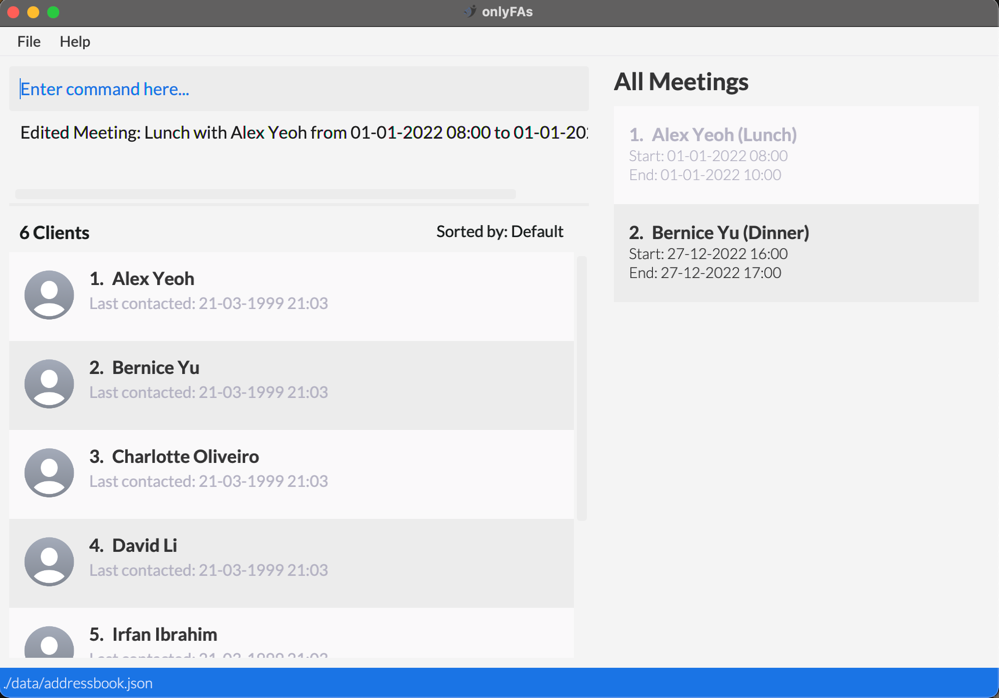

### Delete meeting: `deleteMeeting`

Deletes a specified meeting.

Format: `deleteMeeting INDEX`

#### Sample Input:

`deleteMeeting 1`

#### Expected Output: `Meeting` at `INDEX: 1` is deleted

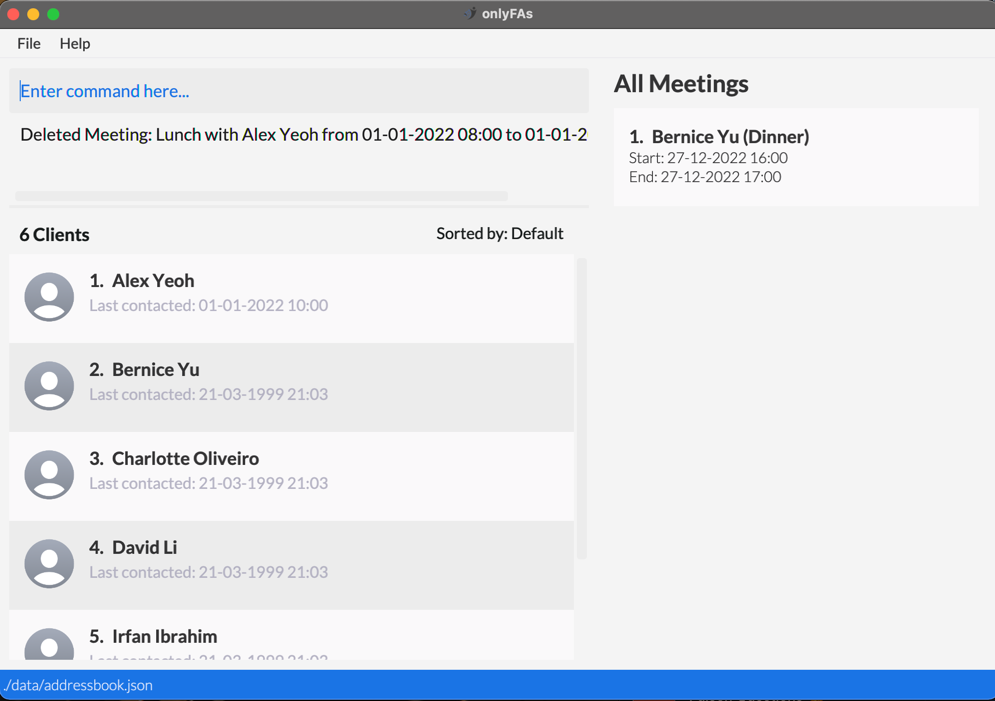

### Close meeting: `closeMeeting`

Closes a meeting and updates the lastContacted of the client that was met to match the end of the meeting.
The meeting will remain in the meeting list and **NOT** be deleted after it is closed.

Format: `closeMeeting INDEX`

#### Sample Input:

`closeMeeting 1`

#### Expected Output: Last contacted date updated to match the end date of the meeting

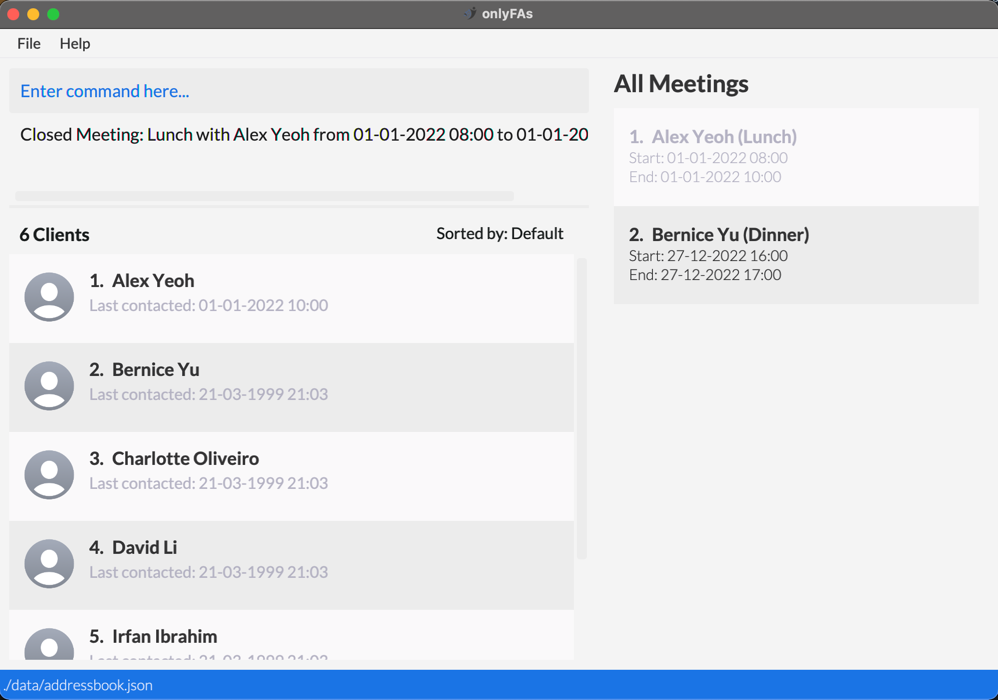
---

## FAQ

**Q**: How do I transfer my data to another Computer? 
**A**: Install the app in the other computer and overwrite the empty data file it creates with the file that contains the data of your previous onlyFAs home folder.

---

## Command summary

| Action            | Format, Examples                                                                                                                                                    |
|-------------------|---------------------------------------------------------------------------------------------------------------------------------------------------------------------|
| **addClient**     | `addClient n/NAME p/PHONE_NUMBER [e/EMAIL] [a/ADDRESS] [b/BIRTHDAY] [lc/LAST_CONTACTED]`   e.g., `addClient n/N Vijay Narayanan p/99134234 a/abc street`         |
| **viewClient**    | `viewClient INDEX`  e.g., `viewClient 1`                                                                                                                         |
| **editClient**    | `editClient INDEX [n/NEW_NAME] [p/NEW_PHONE_NUMBER] [e/NEW_EMAIL] [a/NEW_ADDRESS] [b/NEW_BIRTHDAY] [lc/NEW_LAST_CONTACTED]`  e.g.,`editClient 1 e/new@email.com` |
| **deleteClient**  | `deleteClient INDEX`   e.g., `deleteClient 1`                                                                                                                    |
| **contacted**     | `contacted INDEX lc/LAST_CONTACTED`   e.g., `contacted 1 lc/21-03-2022 21:03`                                                                                    |
| **addNote**       | `addNote INDEX nt/NOTE`   e.g., `addNote 1 nt/Commando NSF with high risk of injury`                                                                             |
| **addPref**       | `addPref INDEX cat/CATEGORY pref/PREFERENCE`   e.g., `addPref 1 cat/Drink pref/Coke`                                                                             |
| **deletePref**    | `deletePref INDEX cat/CATEGORY`   e.g., `deletePref 1 cat/Drink`                                                                                                 |
| **addPolicy**     | `addPolicy INDEX n/POLICY_NAME c/COMPANY pm/POLICY_MANAGER_NAME $/PREMIUM_AMOUNT`   e.g., `addPolicy 1 n/Medicare Plus c/Medicare pm/Zechary $/100`              |
| **editPolicy**    | `editPolicy INDEX pi/POLICY_INDEX [n/POLICY_NAME] [c/COMPANY] [pm/POLICY_MANAGER_NAME] [$/PREMIUM_AMOUNT]`   e.g., `editPolicy 1 pi/1 $/200`                     |
| **deletePolicy**  | `deletePolicy INDEX pi/POLICY_INDEX`   e.g., `deletePolicy 1 pi/1`                                                                                               |
| **meetings**      | `meetings [INDEX] [all/]`   eg., `meetings 1 all/`                                                                                                               |
| **addMeeting**    | `addMeeting INDEX ms/START_DATETIME me/END_DATETIME [l/LABEL]`   e.g., `addMeeting 2 ms/27-12-2022 11:00 me/27-12-2022 12:00 l/Lunch`                            |
| **editMeeting**   | `editMeeting INDEX [ms/NEW_START_DATETIME] [me/NEW_END_DATETIME] [l/NEW_LABEL]`   e.g., `editMeeting 2 ms/27-12-2022 16:00 me/27-12-2022 18:00 l/Dinner`         |
| **deleteMeeting** | `deleteMeeting INDEX`   e.g., `deleteMeeting 2`                                                                                                                  |
| **closeMeeting**  | `closeMeeting INDEX`   e.g., `closeMeeting 3`                                                                                                                    |
| **sortClients**   | `sortClients ATTRIBUTE`   e.g., `sortClients numPolicies`                                                                                                        |
| **filterClients** | `filterClients ATTRIBUTE op/OPERATOR v/VALUE`   e.g., `filterClients age op/equal v/25`                                                                          |
| **help**          | `help`                                                                                                                                                              |
