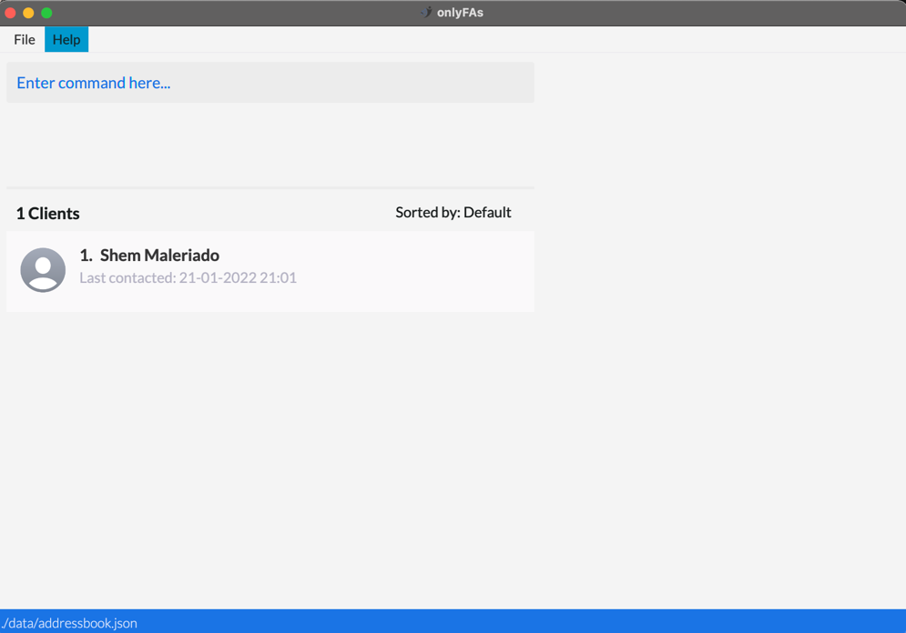
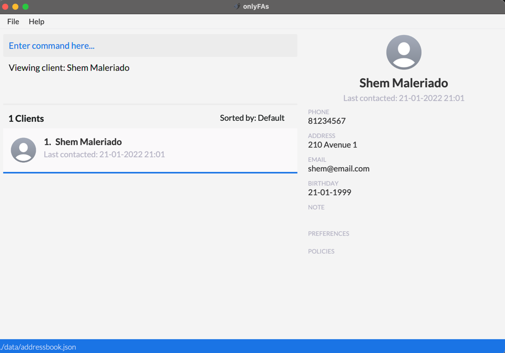

## Introduction - What is onlyFAs?

<strong>onlyFAs</strong> is a Customer Relationship Management (CRM) application targeted at *upcoming* financial
advisors looking to *maintain* and *develop* good relationships with *current* and *potential* clients.

### What can onlyFAs do?

It allows users to:
1. Record all clients in the app
2. Manage their clients' personal details
3. Manage the investment portfolios of each client
4. Track the meetings the user has with their clients
5. Track the date that each client was last contacted

Currently, financial advisors might have to rely on apps like Google Calendar or Microsoft Excel, and do not have a
dedicated platform catered to helping them manage their clientele. This is where *onlyFAs* bridges the gap.

## Table of Contents

- [Quick start](#quick-start)
- [Features](#features)
  1. [Viewing help : `help`](#viewing-help--help)
  2. [Add client: `addClient`](#add-client-addclient)
  3. [View client: `viewClient`](#view-client-viewclient)
  4. [Edit client: `editClient`](#edit-client-editclient)
  5. [Delete client: `deleteClient`](#delete-client-deleteclient)
  6. [Update last contacted of client: `contacted`](#update-last-contacted-of-client-contacted)
  7. [Add notes for client: `addNote`](#add-note-for-client-addnote)
  8. [Add preferences to client: `addPref`](#add-preferences-to-client-addpref)
  9. [Add policy: `addPolicy`](#add-policy-addpolicy)
  10. [Edit policy: `editPolicy`](#edit-policy-editpolicy)
  11. [Delete policy: `deletePolicy`](#delete-policy-deletepolicy)
  12. [Add meeting: `addMeeting`](#add-meeting-addmeeting)
  13. [View All Meetings: `meetings`](#view-meetings-meetings)
  14. [Edit Meeting Details: `editMeeting`](#edit-meeting-details-editmeeting)
  15. [Delete Meeting: `deleteMeeting`](#delete-meeting-deletemeeting)
  16. [Close Meeting: `closeMeeting`](#close-meeting-closemeeting)
  17. [Sort Clients: `sortClients`](#sort-clients-sortclients)
  18. [Filter Clients: `filterClients`](#filter-clients-filterclients)
  19. [Clearing all entries : `clear`](#clearing-all-entries--clear)
  20. [Exiting the program : `exit`](#exiting-the-program--exit)
  21. [Saving the data](#saving-the-data)
  22. [Editing the data file](#editing-the-data-file)
- [FAQ](#faq)
- [Mockups](#mockups)
- [Command summary](#command-summary)

---

## Quick start

1. Ensure you have Java `11` or above installed in your Computer.

1. Download the latest `onlyfas.jar` from [here](https://github.com/AY2122S2-CS2103T-W13-4/tp/releases).

1. Copy the file to the folder you want to use as the **home folder** for _onlyFAs_.

1. Double-click the file to start the app. The GUI similar to the below should appear in a few seconds. Note how the app contains some sample data. 
   

1. Type the command in the command box and press Enter to execute it. e.g. typing **`help`** and pressing Enter will open the help window. 
   Some example commands you can try:

   - **`list`** : Lists all contacts.

   - **`addClient`**`n/John Doe p/98765432 e/johnd@example.com a/John street, block 123, #01-01` : Adds a client
     named `John Doe` to your contact list.

   - **`delete`**`3` : Deletes the 3rd contact shown in the current list.

   - **`clear`** : Deletes all contacts.

   - **`exit`** : Exits the app.

1. Refer to the [Features](#features) below for details of each command.

---

## Features

### Guidelines for Command Format

- Words in `UPPER_CASE` are the parameters to be supplied by the user. 
  e.g. in `add n/NAME`, `NAME` is a parameter which can be used as `add n/John Doe`.

- If the command requires a reference to an INDEX, any leading zeroes (`01`, `001`) will be ignored. 
e.g. in `viewClient 1`, `1` is the INDEX of the specified client, and can be referenced as `01` or `0001` with no regard to the leading zeroes

- Items in square brackets are optional. 
  e.g. `n/NAME [t/TAG]` can be used as `n/John Doe t/friend` or as `n/John Doe`.

- Items with `…`​ after them can be used multiple times including zero times. 
  e.g. `[t/TAG]…​` can be used as ` ` (i.e. 0 times), `t/friend`, `t/friend t/family` etc.

- Parameters can be in any order. 
  e.g. if the command specifies `n/NAME p/PHONE_NUMBER`, `p/PHONE_NUMBER n/NAME` is also acceptable.

- If a parameter is expected only once in the command but you specified it multiple times, only the last occurrence of the parameter will be taken. 
  e.g. if you specify `p/12341234 p/56785678`, only `p/56785678` will be taken.

- Extraneous parameters for commands that do not take in parameters (such as `help`, `list`, `exit` and `clear`) will be ignored. 
  e.g. if the command specifies `help 123`, it will be interpreted as `help`.

### Viewing help : `help`

Shows a message explaining how to access the help page.

Format: `help`

### Add client: `addClient`

Adds a client to the list of managed clients.

Format: `addClient n/NAME p/PHONE_NUMBER [e/EMAIL] [a/ADDRESS] [b/BIRTHDAY] [lc/LAST_CONTACTED]`

- `EMAIL` must be in the format `"local-part@domain"` and adhere to the following constraints
  - The `local-part` should only contain alphanumeric characters and the special characters `+_.-`.
  - The `local-part` cannot start or end with these special characters.
  - This is followed by an `@` and then a domain name. The domain name is made up of labels separated by periods.
  - The domain name must:
    - end with a domain label at least 2 characters long
    - have each domain label start and end with alphanumeric characters
    - have each domain label consist of alphanumeric characters, separated only by hyphens, if any.
- `BIRTHDAY` must be in `dd-MM-yyyy` format.
- `LAST_CONTACTED` must be in `dd-MM-yyyy hh:mm` format.

#### Sample Input:
`addClient n/Vijay Narayanan p/91234567 e/vijay@email.com a/210 Street 3 b/21-03-1999 lc/21-03-2022 21:03` 

#### Expected Output:

### View client: `viewClient`

View a client in your address book. The client to be viewed will appear on the `Dynamic Panel` Section 

Format: `viewClient INDEX`

#### Sample Input:

- `viewClient 1`

#### Expected Output:

### Edit client: `editClient`

Edit a client in your address book.

Format: `editClient INDEX [n/NEW_NAME] [p/NEW_PHONE_NUMBER] [e/NEW_EMAIL] [a/NEW_ADDRESS] [b/NEW_BIRTHDAY] 

- `NEW_BIRTHDAY` must be in `dd-MM-yyyy` format.

#### Sample Input:

`editClient 1 n/Shem Maleriado p/81234567 e/shem@email.com a/210 Avenue 1 b/21-01-1999 lc/21-01-2022 21:01`

#### Expected Output:

### Delete client: `deleteClient`

Delete a client from your address book.

Format: `deleteClient INDEX`

#### Sample Input:

`deleteClient 1`

#### Sample Output:

The client is removed from the application.

### Update last contacted of client: `contacted`

Updates the last contacted datetime of a client.

Format: `contacted INDEX dt/DATETIME`

#### Sample Input:

- `contacted 1 dt/21-03-2022 21:03`

#### Sample Output:

### Add/Edit Notes for client: `addNote`

Adds a plaintext note to a specific client. If the client already has an existing note, **replaces** that note with the
note specified from this command.

Format: `addNote 1 nt/NOTE`

#### Sample Input 1: Adding a new Note to a Client
`addNote 1 nt/Commando NSF with high risk of injury`

#### Expected Output: New Note added to Client

#### Sample Input 2: Editing existing Note on Client

`addNote 2 nt/Look up on policies for emergency care`

#### Expected Output: Existing Note on Client overwritten

### Add/Edit preferences to client: `addPref`

Adds a preference to a specific client. If a preference already exists in that category, **replaces** that preference
with the preference specified by this command

Format: `addPref INDEX cat/CATEGORY pref/PREFERENCE`

#### Sample Input 1: Adding a new preference to Client

`addPref 1 cat/Drink pref/Coke`

#### Expected Output:

#### Sample Input 2: Editing an existing preference on Client

`addPref 2 cat/Drink pref/Beer`

Previously, there was an existing preference of `cat/Drink pref/Coke` on the Client

#### Expected Output:

The previous preference is overwritten and replaced with `cat/Drink pref/Beer`

### Delete preferences from client: `deletePref`

Deletes the preference from the specified client

Format: `deletePref INDEX cat/CATEGORY`

Examples:

- `deletePref 1 cat/Drink`
- `deletePref 2 cat/Cigarettes`

### Add policy: `addPolicy`

Adds an insurance policy to a specific client

Format: `addPolicy INDEX n/POLICY_NAME c/COMPANY pm/POLICY_MANAGER_NAME $/PREMIUM_AMOUNT`

Examples:

- `addPolicy 1 n/Medicare Plus c/Medicare pm/Zechary $/100`
- `addPolicy 2 n/Car Insurance c/Mercedes pm/Vijay $/250`

### Edit policy: `editPolicy`

Updates an insurance policy for a specific client

Format: `editPolicy INDEX pi/POLICY_INDEX [n/POLICY_NAME] [c/COMPANY] [pm/POLICY_MANAGER_NAME] [$/PREMIUM_AMOUNT]`

Examples:

- `editPolicy 1 pi/1 $/200`
- `editPolicy 1 pi/2 n/Car Insurance Plus c/Mercedes pm/Zechary $/350`

### Delete policy: `deletePolicy`

Deletes an insurance policy from a specific client

Format: `deletePolicy INDEX pi/POLICY_INDEX`

Examples:

- `deletePolicy 1 pi/1`

### Add meeting: `addMeeting`

Add a meeting to your schedule.

Format: `addMeeting INDEX ms/START_DATETIME me/END_DATETIME [l/LABEL]`

:bulb: **Tip:**
    Date format is dd-MM-yyyy HH:mm

Examples:

- `addMeeting 1 ms/01-01-2022 11:00 me/01-01-2022 12:00`
- `addMeeting 2 ms/27-12-2022 16:00 me/27-12-2022 17:00 l/Dinner`

### View Meetings: `meetings`

Shows upcoming or all meetings.

- If an index is provided, only shows meetings with the specified client.
- If the `all/` flag is omitted, **ONLY** shows upcoming meetings (meetings that start today or in the future).
- If the `all/` flag is provided, shows all meetings instead of just upcoming meetings.

Format: `meetings [INDEX] [all/]`

Examples:
- `meetings`
- `meetings 2`
- `meetings 3 all/`

### Edit Meeting Details: `editMeeting`

Edit details of a particular meeting.

Format: `editMeeting INDEX [ms/NEW_START_DATETIME] [me/NEW_END_DATETIME] [l/LABEL]`

:bulb: **Tip:**
    Date format is dd-MM-yyyy HH:mm

Examples:

- `editMeeting 1 ms/01-01-2022 08:00 me/01-01-2022 10:00 l/Lunch`

### Delete meeting: `deleteMeeting`

Deletes a meeting

Format: `deleteMeeting INDEX`

Examples:

- `deleteMeeting 1`

### Close meeting: `closeMeeting`

Closes a meeting and updates the lastContacted of the client that was met to match the end of the meeting.
The meeting will remain in the meeting list and not be deleted after it is closed.

Format: `closeMeeting INDEX`

Examples:

- `closeMeeting 1`

### Sort clients: `sortClients`

Retrieve a sorted list of clients based on the provided attribute and sort direction.

Format: `sortClients [ATTRIBUTE] [dir/SORT_DIRECTION]`

Supported attributes:
1. `numPolicies`, clients will be sorted based on the number of policies that they have.
2. `premium`, clients will be sorted based on their total premium sum for all their policies.
3. `lastContacted` clients will be sorted based on when they were last contacted.

Note to Users:

1. Sort direction refers to either `asc` (short for ascending) or `desc` (short for descending).
2. If no sort direction is provided, the default sort direction will be `desc`
3. If no attribute is provided, the list of clients will be sorted by default in the order that the clients were added
   to the list.

Examples:

- `sortClients`
- `sortClients numPolicies`
- `sortClients premium`
- `sortClients lastContacted`

### Filter clients: `filterClients`

Retrieve a filtered list of clients based on the provided operator and value.

Format: `filterClients ATTRIBUTE op/OPERATOR v/VALUE`

Note to Users:

The `filterClients` command is a complex command involving 3 parameters:

1. Attribute: the attribute to be filtered on

    Supported attributes: `birthMonth`, `age`, `premium`, `company`

2. Operator: the desired filter range

    Supported operators: `greaterorequal`, `greater`, `equal`, `lesser`, `lesserorequal`
    * Note: The only operator supported for `company` is `equal`

3. Value: the value to be filtered around

- `birthMonth`: Accepts text inputs represent months of the year. Example: `february`, `march`
- `age`: Accepts integer values. Example: `25`, `27`
- `premium`: Accepts integer values. Example: `25`, `27`
- `company`: Accepts text inputs represent companies. Example: `Great Eastern`, `AAM`

Examples:

1. `filterClients age op/equal v/25`: Retrieves all clients of `age` = `25`
2. `filterClients birthMonth op/lesser v/february`: Retrieves all clients with birthdays before `february`
3. `filterClients premium op/greater v/10000` Retrieves all clients that pay at least $`10000` in `premium`s
   annually
4. `filterClients company op/equal v/Great Eastern` Retrieves all clients who own at least one policy from `Great
   Eastern`

### Save to hard drive

OnlyFAs’s data is saved in the hard drive automatically after any command that changes the data. There is no need to save manually.

### Clearing all entries : `clear`

Clear all entries in onlyFAs.

Format: `clear`

### Exiting the program : `exit`

Exit the program.

Format: `exit`

### Saving the data

onlyFAs' data is saved in the hard disk automatically after any command that changes the data. There is no need to save manually.

### Editing the data file

onlyFAs' data is saved in a JSON file `[JAR file location]/data/data.json`. Advanced users are welcome to update data directly by editing that data file.

:exclamation: **Caution:**
If your changes to the data file makes its format invalid, onlyFAs will discard all data and start with an empty data file at the next run.

---

## FAQ

**Q**: How do I transfer my data to another Computer? 
**A**: Install the app in the other computer and overwrite the empty data file it creates with the file that contains the data of your previous onlyFAs home folder.

---

## Command summary

| Action            | Format, Examples                                                                                                                                       |
|-------------------|--------------------------------------------------------------------------------------------------------------------------------------------------------|
| **addClient**     | `addClient n/NAME p/PHONE_NUMBER [e/EMAIL a/ADDRESS]`   e.g., `addClient n/N Vijay Narayanan p/99134234 a/abc street`                               |
| **viewClient**    | `viewClient INDEX`  e.g., `viewClient 1`                                                                                                            |
| **editClient**    | `editClient INDEX [n/NEW_NAME p/NEW_PHONE_NUMBER e/NEW_EMAIL a/NEW_ADDRESS]`  e.g.,`editClient 1 e/new@email.com`                                   |
| **deleteClient**  | `deleteClient INDEX`   e.g., `deleteClient 1`                                                                                                       |
| **contacted**     | `contacted INDEX dt/DATETIME`   e.g., `contacted 1 dt/21-03-2022 21:03`                                                                             |
| **addNote**       | `addNote INDEX nt/NOTE`   e.g., `addNote 1 nt/Commando NSF with high risk of injury`                                                                |
| **addPref**       | `addPref INDEX cat/CATEGORY pref/PREFERENCE`   e.g., `addPref 1 cat/Drink pref/Coke`                                                                |
| **deletePref**    | `deletePref INDEX cat/CATEGORY`   e.g., `deletePref 1 cat/Drink`                                                                                    |
| **addPolicy**     | `addPolicy INDEX n/POLICY_NAME c/COMPANY pm/POLICY_MANAGER_NAME $/PREMIUM_AMOUNT`   e.g., `addPolicy 1 n/Medicare Plus c/Medicare pm/Zechary $/100` |
| **editPolicy**    | `editPolicy INDEX pi/POLICY_INDEX [n/POLICY_NAME] [c/COMPANY] [pm/POLICY_MANAGER_NAME] [$/PREMIUM_AMOUNT]`   e.g., `editPolicy 1 pi/1 $/200`        |
| **deletePolicy**  | `deletePolicy INDEX pi/POLICY_INDEX`   e.g., `deletePolicy 1 pi/1`                                                                                  |
| **meetings**      | `meetings [INDEX] [all/]`   eg., `meetings 1 all/`                                                                                                  |
| **addMeeting**    | `addMeeting INDEX ms/START_DATETIME me/END_DATETIME [l/LABEL]`   e.g., `addMeeting 2 ms/27-12-2022 11:00 me/27-12-2022 12:00 l/Lunch`               |
| **editMeeting**   | `editMeeting INDEX [ms/START_DATETIME] [me/END_DATETIME] [l/LABEL]`   e.g., `editMeeting 2 ms/27-12-2022 16:00 me/27-12-2022 18:00 l/Dinner`        |
| **deleteMeeting** | `deleteMeeting INDEX`   e.g., `deleteMeeting 2`                                                                                                     |
| **closeMeeting**  | `closeMeeting INDEX`   e.g., `closeMeeting 3`                                                                                                       |
| **sortClients**   | `sortClients ATTRIBUTE`   e.g., `sortClients numPolicies`                                                                                           |
| **filterClients** | `filterClients ATTRIBUTE op/OPERATOR v/VALUE`   e.g., `filterClients age op/equal v/25`                                                             |
| **help**          | `help`                                                                                                                                                 |
