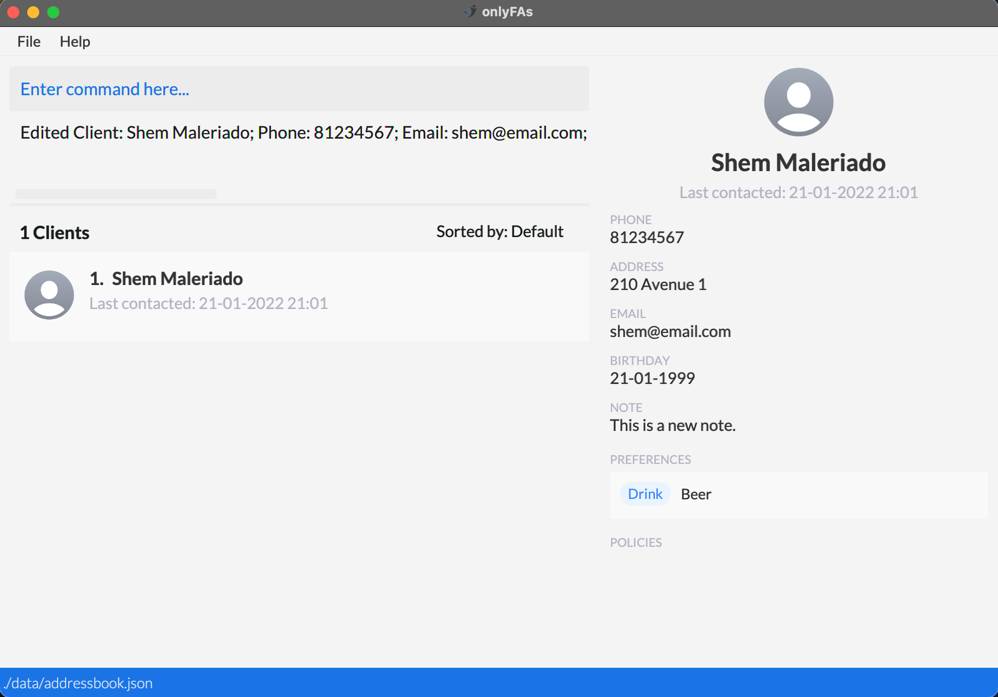
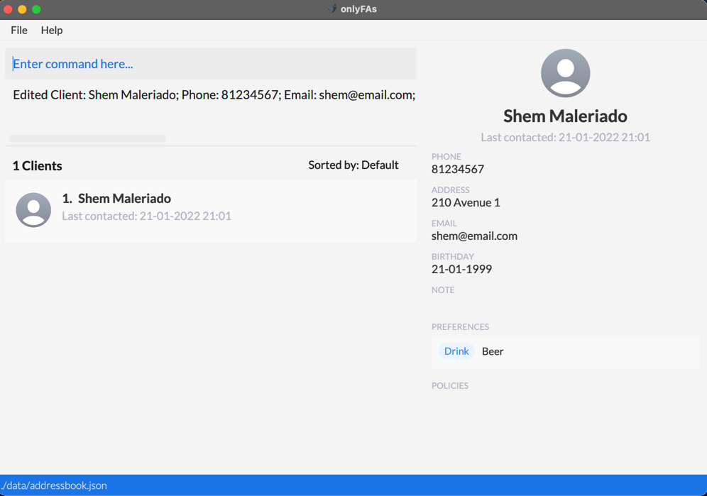
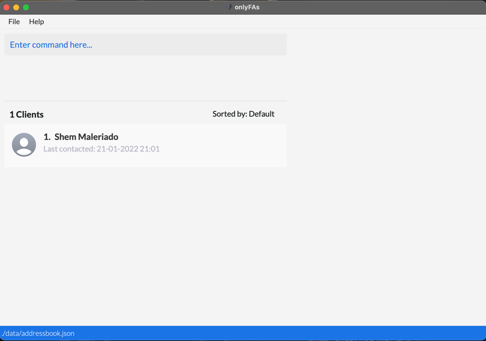
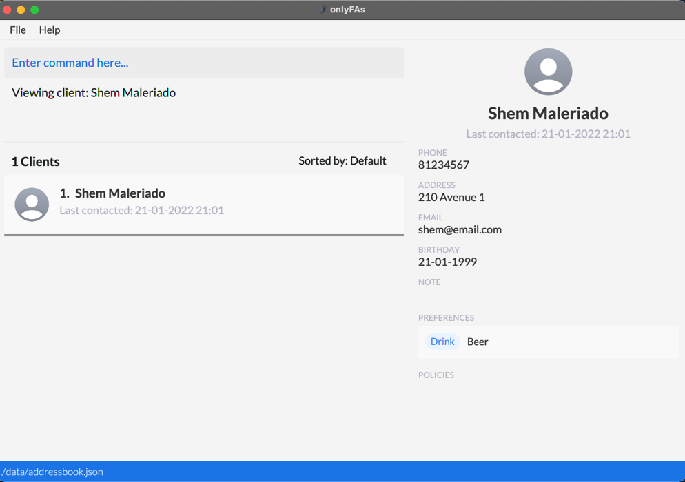
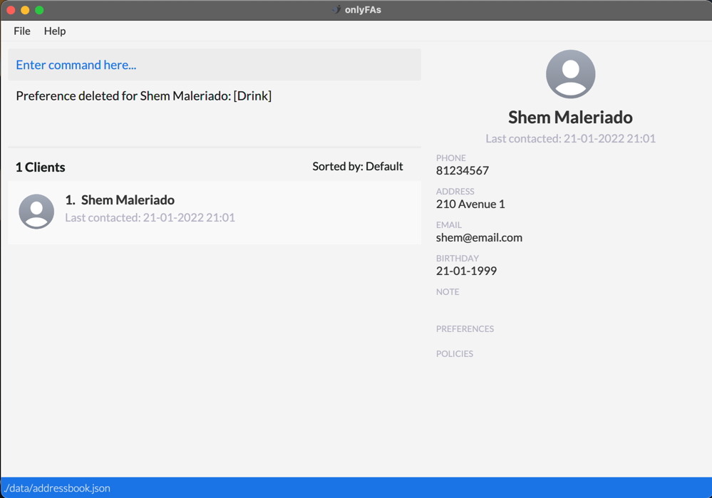

### Project: onlyFAs

onlyFAs is a desktop client-management application used by high achieving financial advisors looking to maintain and develop good relationships with current and potential clients. THe user interacts with it using a CLI, and it has a GUI created with JavaFX. It is written in Java.

Given below are my contributions to the project.

- **Code contributed**: [RepoSense link](https://nus-cs2103-ay2122s2.github.io/tp-dashboard/?search=zechajw&breakdown=true)

- **Enhancements implemented**:

#### 1. Notes Feature
Related User Stories: 
- As a first time user, I can add notes about my clients so that I can have a better personal understanding of each of my clients
- As a user, I can delete notes from a specific client so that I can remove notes that are no longer useful
    

Description of Feature:  
`Note` is an additional attribute added to the main `Client` class. Users can call the command `addNote` to add/edit
an existing note on the `Client`, and they can call the `deleteNote` command to delete the current note on the client

Implementation:
1. Creation of a `Note` class in the object model that forms an aggregation relationship with the `Client` class.
The inner implementation of `Note` uses a simple `String` value with no formatting checks.
2. Integrating it into the current `Client`. This involved adding a new parameter to the existing `Client` constructor and 
changing any test cases to prevent regression bugs. Furthermore, the `ClientBuilder` had to be updated to add a Note to the
`Client` when building during test cases.

Example of Usage:

Command to add a note to the client, e.g. `addNote 1 nt/This is a new note` is called

The note is added to the client, and can be seen in the `NOTE` section in the right panel.

If `deleteNote 1` is called to delete the note,

#### 2. Preferences Feature

Related User Stories:
1. As an intermediate user, I can record my clients' individual preferences so that I can better cater to their needs
2. As an intermediate user, I can obtain my client's preferences so that I have a quick and easy way to obtain information on my client's preferences
3. As an intermediate user, I can delete preferences from a specific client so that I can maintain an updated list of my client's preferences for easy access at all times.

Description of Feature:  
`PreferenceMap` is an additional attribute to the main `Client` class. The `PreferenceMap` stores a `HashMap` of `String, String` pairs
that allow users to call the `addPref` command to add key, value pairs to the `PreferenceMap`. For example, the user can call
`addPref 1 cat/Drink pref/Beer` to indicate the `Client` has a `Drink` preference of `Beer`
    
Implementation:
1. Creation of a `PreferenceMap` class in the object model that contains a `HashMap<String, String>` and handles the inner implementation
of the preferences `HashMap`. The `PreferenceMap` has a method `addPreference(String, String)` that the client can call to add
a new preference to the `PreferenceMap`. It also has a method `deletePreference(String)` that checks whether there is an existing preference
in that category. If there is, delete the preference. Otherwise, throw an error indicating the there is no such preference and prompt
the user to try again.
2. Integrating it into the current `addressbook.json` format by creating a `JSONAdaptedPreferenceMap` class that allows the inner `HashMap`
to be stored as a JSON. On application reopen, the constructor will take in the `JSON::HashMap` from the storage and reinitialize
the `PreferenceMap`
3. Integrating it into the current `Client`. This involved adding a new parameter to the existing `Client` constructor and
   changing any test cases to prevent regression bugs. Furthermore, the `ClientBuilder` had to be updated to add a PreferenceMap to the
   `Client` when building during test cases.

Example of Usage:

Command to add a preference to the client, e.g. `addPref 1 cat/Drink pref/Beer` is called

The preference is added to the client, as can be seen in the panel on the right.

If `deletePref 1 cat/Drink` is called to delete the preference with `cat/Beer`

The preference is deleted.

#### 3. Filter Feature

Related User Stories:

Description of Feature:

Implementation:

Example of Usage:

- **Contributions to the UG**:

- **Contributions to the DG**:

- **Review/mentoring contributions**:

- **Contributions beyond the project team:**:
